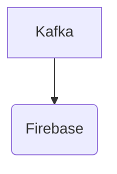

# Connect Kafka to Firebase

Quix helps you integrate Kafka to Firebase using pure Python.

## Firebase

Firebase is a mobile and web development platform that provides developers with a wide array of tools and services to create high-quality applications efficiently. Developed by Google, Firebase offers services such as a real-time database, cloud messaging, authentication, hosting, and analytics. One of the key features of Firebase is its real-time database, which allows developers to store and sync data across all clients in real-time. This makes it easy for developers to create collaborative, interactive applications that can be accessed from anywhere. In addition, Firebase also provides secure authentication services, allowing developers to easily manage user authentication and authorization within their applications. Overall, Firebase is a powerful and versatile platform that simplifies the development process and allows developers to focus on creating innovative and engaging applications.

## Integrations

Quix is a good fit for integrating with Firebase because of its real-time data processing capabilities and scalability. Firebase is a platform developed by Google for creating mobile and web applications. It provides various services such as authentication, database, and hosting, which can benefit from real-time data processing and monitoring.

By integrating Quix with Firebase, developers can leverage the platform's streamlined development and deployment features to easily create and deploy data pipelines for processing Firebase data in real-time. The enhanced collaboration tools in Quix Cloud can also facilitate efficient teamwork among developers working on Firebase projects.

Additionally, the real-time monitoring and scaling capabilities of Quix Cloud can help developers effectively monitor and manage the performance of their Firebase data pipelines. With features like flexible scaling and management, users can easily adjust resources and handle multiple environments linked to Git branches, ensuring smooth operation of Firebase applications.

Furthermore, Quix Streams' support for serialization formats and stateful operations, as well as time window aggregations, can be beneficial for processing and analyzing data from Firebase in a scalable and efficient manner. The robust CI/CD processes available in Quix Cloud can also streamline the deployment and integration of Firebase applications with other services.

In conclusion, integrating Quix with Firebase can provide developers with a comprehensive solution for real-time data processing and monitoring, enhancing the functionality and performance of Firebase applications.

