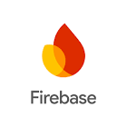
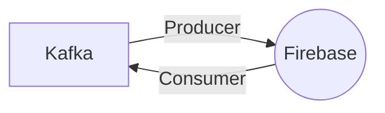

# Connect Kafka to Firebase

Quix helps you integrate Kafka to Firebase using pure Python.

<a class="md-button md-button--primary" href="https://share.hsforms.com/1iW0TmZzKQMChk0lxd_tGiw4yjw2?__hstc=175542013.2303933fbd746c0ac86d9ccbe9bc9100.1728383268831.1729603416735.1729620918855.31&__hssc=175542013.1.1729620918855&__hsfp=2132701734" target="_blank" style="margin-right:.5rem;">Book a demo</a>
 

## Firebase

Firebase is a mobile and web application development platform that provides developers with a plethora of tools and services to build, improve, and grow their apps. It offers features such as real-time database, authentication, cloud messaging, hosting, analytics, and more, all seamlessly integrated into one platform. Firebase's real-time database allows developers to store and sync data in real-time between clients, while its authentication service provides secure user authentication with customizable and easy-to-use sign-in methods. With its cloud messaging service, developers can send notifications to engage their users and keep them coming back to the app. Overall, Firebase is a powerful and versatile technology that enables developers to create innovative and engaging apps with ease.

## Integrations

Quix is a good fit for integrating with Firebase due to several key factors:

1. Real-time Data Processing: Quix Cloud is designed for developing and managing real-time data pipelines, making it well-suited for integrating with Firebase, which also specializes in real-time data processing. This synergy allows for seamless and efficient data transfer and processing between the two platforms.

2. Enhanced Collaboration and Monitoring: Quix Cloud offers features for enhanced collaboration and real-time monitoring of pipeline performance. By integrating with Firebase, users can benefit from robust collaboration tools and real-time monitoring capabilities, ensuring efficient management and optimization of data processing tasks.

3. Flexible Scaling: Quix Cloud provides flexible scaling options and resource management capabilities, allowing users to easily scale resources and handle multiple environments. This aligns well with Firebase's scalable infrastructure, enabling seamless scaling of data processing tasks as needed.

4. Security and Compliance: Quix Cloud ensures secure management of secrets and compliance with dedicated infrastructure options. By integrating with Firebase, users can maintain high levels of security and compliance when processing sensitive data, making it a reliable choice for handling critical data processing tasks.

5. Development Tools: Quix Cloud offers a range of development tools, including online code editors and connectors for various data sources. This complements Firebase's data processing capabilities, allowing for efficient development and deployment of data pipelines.

6. Kafka Integration: Quix Cloud supports Kafka integration, which is a common technology used for real-time data processing. This compatibility with Kafka makes Quix a suitable choice for integrating with Firebase, enabling seamless data transfer and processing between the two platforms.

Overall, the comprehensive features and capabilities of Quix Cloud make it a strong candidate for integrating with Firebase, providing users with a seamless and efficient platform for real-time data processing and management.

