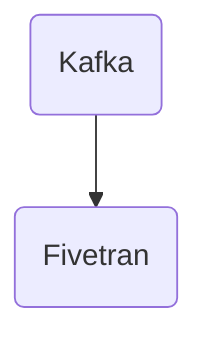

# Connect Kafka to Fivetran

Quix helps you integrate Kafka to Fivetran using pure Python.

## Fivetran

Fivetran is a cloud-based data integration platform that helps businesses streamline their data pipeline by automating the process of data integration. With Fivetran, organizations can easily connect and centralize their data sources, such as CRM systems, databases, marketing platforms, and more, without the need for manual coding or maintenance. Fivetran uses pre-built connectors to extract data from various sources and load it into a data warehouse or cloud storage, making it easy for users to access and analyze their data in real-time. This technology enables businesses to make better, data-driven decisions by providing them with a unified view of all their data in one centralized location.

## Integrations

Quix is a good fit for integrating with Fivetran because of their comprehensive platform and features that streamline development, enhance collaboration, and provide real-time monitoring and scaling capabilities. 

1. Streamlined Development and Deployment: Quix Cloud offers integrated online code editors and CI/CD tools that simplify the creation and deployment of data pipelines. This aligns well with Fivetran's goal of simplifying data integration and pipeline development.

2. Enhanced Collaboration: Quix Cloud supports efficient collaboration with organization and permission management, increasing project visibility and control. This can help teams using Fivetran to collaborate more effectively on data pipeline development.

3. Real-Time Monitoring: Quix Cloud provides tools for real-time logs, metrics, and data exploration, allowing users to monitor pipeline performance and critical metrics. This real-time monitoring capability can complement Fivetran's data integration platform, providing users with valuable insights into the performance of their pipelines.

4. Flexible Scaling and Management: Quix Cloud makes it easy for users to scale resources, manage CPU and memory, and handle multiple environments linked to Git branches. This scalability and management flexibility can benefit users of Fivetran who need to scale their data integration processes as their data volumes increase.

In addition, Quix Streams, with its cloud-native library for processing data in Kafka using Python, can seamlessly integrate with Fivetran's data integration platform. Quix Streams' features such as Python ecosystem integration, serialization and state management, time window aggregations, and resilient scaling align well with the capabilities that Fivetran offers, making it a good fit for integrating with Fivetran. By leveraging both Quix and Fivetran, users can achieve a more efficient and streamlined data integration and pipeline development process.

