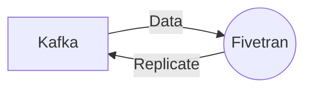

# Connect Kafka to Fivetran

Quix helps you integrate Kafka to Fivetran using pure Python.

<a class="md-button md-button--primary" href="https://share.hsforms.com/1iW0TmZzKQMChk0lxd_tGiw4yjw2?__hstc=175542013.2303933fbd746c0ac86d9ccbe9bc9100.1728383268831.1729603416735.1729620918855.31&__hssc=175542013.1.1729620918855&__hsfp=2132701734" target="_blank" style="margin-right:.5rem;">Book a demo</a>
 

## Fivetran

Fivetran is a powerful data integration technology that automates the process of connecting data sources to a central data warehouse. This software-as-a-service solution enables businesses to easily consolidate data from a variety of sources, such as databases, cloud applications, and marketing platforms, without the need for manual coding or complex ETL processes. Fivetran's pre-built connectors and robust data pipeline ensure that data is continuously synced and readily available for analysis, making it a valuable tool for organizations looking to streamline their data integration process and gain actionable insights from their data. With Fivetran, businesses can quickly and accurately access a comprehensive view of their data, enabling them to make informed decisions and drive growth.

## Integrations

Quix is a good fit for integrating with Fivetran because it offers a comprehensive platform for developing, deploying, and managing real-time data pipelines. With features like streamlined development and deployment, enhanced collaboration, real-time monitoring, and flexible scaling and management, Quix provides the necessary tools to integrate seamlessly with Fivetran.

Additionally, Quix Cloud's support for robust CI/CD processes aligns well with Fivetran's focus on automating data pipelines and ensuring data consistency and reliability. With Quix Streams, a cloud-native library for processing data in Kafka using Python, users can leverage the scalability of Kafka along with a user-friendly Python interface, making it easier to work with data in real-time.

Furthermore, Quix's integration with various data sources and sinks, as well as its support for different serialization formats and stateful operations, make it a versatile tool for working with diverse data sets. The platform's security and compliance features also ensure that sensitive data is handled securely, which is crucial for organizations using Fivetran to manage their data.

Overall, Quix's range of features and integrations make it a suitable choice for organizations looking to streamline their data pipeline development and management with Fivetran.

