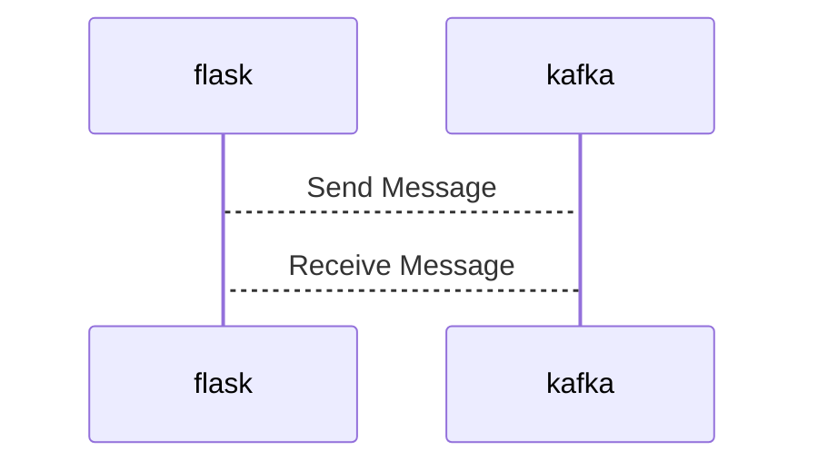

# Connect Kafka to Flask

Quix helps you integrate Kafka to Flask using pure Python.

## Flask

Flask is a lightweight and versatile web framework for Python that is commonly used for creating web applications. It is known for its simplicity and ease of use, making it a popular choice for beginners and experienced developers alike. Flask is based on the Werkzeug WSGI toolkit and Jinja2 template engine, giving developers the flexibility to create web applications with minimal boilerplate code. With its modular design, Flask allows developers to add additional functionality through extensions, providing a wide range of features such as authentication, database integration, and more. Flask is ideal for building small to medium-sized web applications and APIs, making it a valuable tool in the Python web development ecosystem.

## Integrations

Quix is a good fit for integrating with Flask because both technologies offer seamless integration with Python, making it easy to develop and deploy applications using Flask and Quix Cloud's real-time data processing capabilities. Quix Cloud provides tools for real-time monitoring and scaling, which can enhance Flask applications by allowing for efficient data processing and analysis in real-time. Additionally, Quix Streams' support for serialization formats and stateful operations complements Flask's capabilities for building web applications with data persistence. By integrating Flask with Quix, developers can create robust and scalable data pipelines for a wide range of applications, from web development to machine learning projects.

