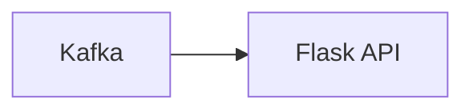

# Connect Kafka to Flask

Quix helps you integrate Kafka to Flask using pure Python.

<a class="md-button md-button--primary" href="https://share.hsforms.com/1iW0TmZzKQMChk0lxd_tGiw4yjw2?__hstc=175542013.2303933fbd746c0ac86d9ccbe9bc9100.1728383268831.1729603416735.1729620918855.31&__hssc=175542013.1.1729620918855&__hsfp=2132701734" target="_blank" style="margin-right:.5rem;">Book a demo</a>
 

## Flask

Flask is a lightweight and versatile web framework written in Python that is commonly used for building web applications. It is known for its simplicity and flexibility, making it a popular choice for developers who prefer a minimalistic approach to web development. Flask provides all the essential features needed for building web applications, such as routing, request handling, and template rendering, while also allowing developers to easily extend its functionality with various plugins and extensions. With its modular design and well-documented API, Flask enables developers to quickly create scalable and efficient web applications with ease.

## Integrations

Flask is a popular web framework for building APIs and web applications in Python. It is known for its simplicity and flexibility, making it well-suited for integrating with various libraries and tools. 

Quix, being a platform focused on developing, deploying, and managing real-time data pipelines, can benefit from integrating with Flask for several reasons:

1. Python Compatibility: Both Quix and Flask are written in Python, making it seamless to integrate the two technologies without compatibility issues.

2. Web Development Capabilities: Flask�s lightweight and modular design make it an excellent choice for building web interfaces and dashboards for monitoring and managing data pipelines in Quix.

3. Extensibility: Flask�s modular structure allows developers to integrate additional functionalities and third-party libraries easily, making it adaptable to the specific requirements of Quix's users.

4. Integration with Quix Streams: Quix Streams, a cloud-native library for processing data in Kafka using Python, can also benefit from Flask�s web development capabilities to create interactive interfaces for visualizing and exploring the data processed through Kafka.

5. Simplified Deployment: Flask�s built-in development server and support for various deployment options (such as Gunicorn, uWSGI, or Docker) can streamline the deployment process of Quix pipelines and applications built on top of Quix Streams.

Overall, integrating Quix with Flask can enhance the development, monitoring, and management experience of real-time data pipelines in Quix Cloud, providing users with a seamless and efficient platform for working with data.

