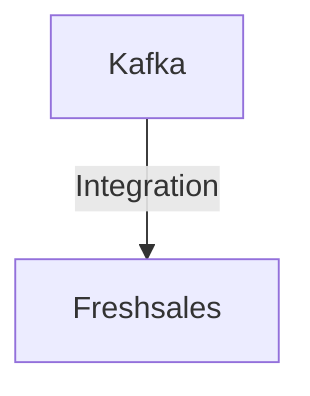

# Connect Kafka to Freshsales

Quix helps you integrate Kafka to Freshsales using pure Python.

## Freshsales

Freshsales is a modern and user-friendly customer relationship management (CRM) software that helps businesses effectively manage their sales processes. With features such as lead scoring, email tracking, and pipeline management, Freshsales allows sales teams to quickly and efficiently organize their leads, track interactions, and prioritize their activities. This technology integrates seamlessly with other tools and platforms, making it easy for businesses to streamline their sales efforts and improve their overall productivity. Additionally, Freshsales offers advanced analytics and reporting capabilities, providing valuable insights into sales performance and helping businesses make data-driven decisions. Overall, Freshsales is a powerful and versatile CRM solution that can greatly benefit sales teams in today's competitive business environment.

## Integrations

Quix Streams and Quix Cloud are both excellent choices for integrating with Freshsales due to their comprehensive features and capabilities that align well with the needs of real-time data pipelines. 

Quix Cloud's streamlined development and deployment tools, enhanced collaboration features, real-time monitoring capabilities, and flexible scaling options make it ideal for managing and optimizing data pipelines in Freshsales. The platform's dedicated infrastructure options and security measures ensure that data is managed securely and in compliance with regulations.

Similarly, Quix Streams' cloud-native library for processing data in Kafka using Python is a great fit for integrating with Freshsales. Its seamless integration with the Python ecosystem, support for various serialization formats, and time window aggregations make it easy to process and analyze data in real-time. Additionally, its resilience and scalability features ensure that data pipelines can handle increasing volumes of data without compromising performance.

Overall, both Quix Streams and Quix Cloud offer the necessary tools and capabilities to integrate with Freshsales effectively, making them a strong choice for organizations looking to streamline their data processing and analysis workflows.

