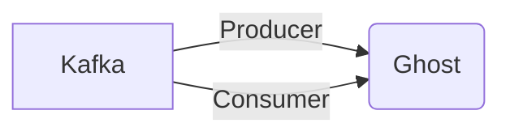

# Connect Kafka to Ghost

Quix helps you integrate Kafka to Ghost using pure Python.

## Ghost

Ghost is a revolutionary technology that allows users to create and manage their own websites with ease. Utilizing a clean and intuitive interface, Ghost empowers users to focus on creating compelling content without being bogged down by complex design elements. With built-in SEO tools, responsive themes, and a markdown editor, Ghost streamlines the website creation process, making it accessible to both beginners and experienced users alike. Additionally, Ghost offers powerful customization options, allowing users to tailor their websites to suit their unique needs and preferences. Overall, Ghost is a versatile and user-friendly platform that redefines the way websites are created and maintained.

## Integrations

Quix is a good fit for integrating with the technology called Ghost because it provides a comprehensive platform for developing, deploying, and managing real-time data pipelines. With features like streamlined development and deployment, enhanced collaboration, real-time monitoring, and flexible scaling and management, Quix Cloud can easily handle the complexities of working with Ghost.

For instance, Ghost may generate a large amount of real-time data that needs to be processed and analyzed quickly. Quix Streams, with its ability to process data in Kafka using Python, offers a user-friendly interface and seamless integration with Python libraries like Pandas, scikit-learn, TensorFlow, and PyTorch. This allows developers to efficiently process and analyze the data generated by Ghost.

Additionally, Quix Cloud's support for Kafka integration and data exploration and visualization tools enables users to monitor pipeline performance and visualize critical metrics in real-time. This is essential for ensuring that the Ghost technology is running smoothly and efficiently.

Furthermore, Quix Cloud's security and compliance features ensure that sensitive data processed by Ghost is securely managed and compliant with regulatory requirements. This is crucial for organizations that need to adhere to strict security and compliance standards.

In conclusion, the combination of Quix with Ghost technology provides a powerful and efficient solution for real-time data processing and analysis. Its streamlined development tools, enhanced collaboration capabilities, and real-time monitoring features make it an ideal platform for integrating with Ghost and harnessing the full potential of real-time data pipelines.

