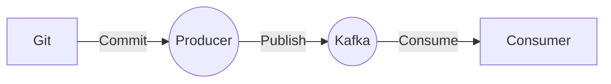

# Connect Kafka to Git

Quix helps you integrate Kafka to Git using pure Python.

## Git

Git is a distributed version control system designed for tracking changes in source code during software development. It allows multiple developers to collaborate on a project by managing changes to the codebase, tracking who made those changes, and allowing for easy merging of different versions of the code. Git stores these changes in a repository, allowing developers to easily revert to previous versions if needed. It also provides features such as branching, which allows developers to work on multiple versions of the code simultaneously without impacting each other's work. Git has become an essential tool for modern software development, providing a seamless and efficient way for teams to work together on complex projects.

## Integrations

Quix is a good fit for integrating with Git because of its comprehensive platform features that streamline development, enhance collaboration, provide real-time monitoring capabilities, and support secure management of secrets and compliance.

1. Streamlined Development and Deployment: Quix Cloud's integrated online code editors and CI/CD tools simplify the creation and deployment of data pipelines. With YAML synchronization, defining pipelines and environment variables as code can easily be managed and version controlled with Git.

2. Enhanced Collaboration: Quix Cloud supports efficient collaboration with organization and permission management, increasing project visibility and control. Integration with Git providers like GitHub and Bitbucket facilitates seamless CI/CD processes, ensuring that changes are tracked and managed effectively by the team.

3. Real-Time Monitoring: Quix Cloud provides tools for real-time logs, metrics, and data exploration, allowing users to monitor pipeline performance and critical metrics. This real-time monitoring capability can enhance the visibility and efficiency of the development process when integrated with the version tracking and collaboration features of Git.

4. Flexible Scaling and Management: The platform allows users to easily scale resources, manage CPU and memory, and handle multiple environments linked to Git branches. This integration with Git branches can facilitate the management of different versions and configurations of pipelines, ensuring a smooth and controlled deployment process.

5. Security and Compliance: Quix Cloud ensures secure management of secrets and compliance with dedicated infrastructure options and SLAs. By integrating with Git, access control and compliance requirements can be enforced through version-controlled access permissions and audit trails.

Overall, by integrating Quix with Git, organizations can benefit from a seamless development, deployment, monitoring, and collaboration process, ensuring efficient and secure management of real-time data pipelines.

