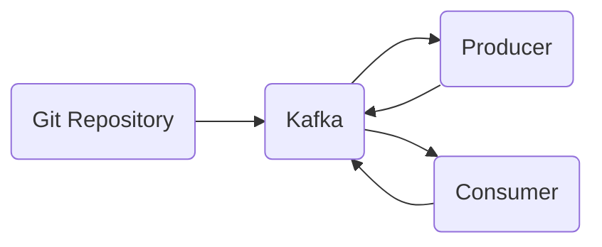

# Connect Kafka to Git

Quix helps you integrate Kafka to Git using pure Python.

- __Find out how we can help you integrate!__

    <a class="md-button md-button--primary" href="https://share.hsforms.com/1iW0TmZzKQMChk0lxd_tGiw4yjw2?__hstc=175542013.2303933fbd746c0ac86d9ccbe9bc9100.1728383268831.1729603416735.1729620918855.31&__hssc=175542013.1.1729620918855&__hsfp=2132701734" target="_blank" style="margin:.5rem;">Book a demo</a>

## Git

Git is a distributed version control system used primarily for tracking changes in source code during software development. It allows multiple developers to collaborate on a project by keeping a complete history of all changes made to the code base. Git works by creating snapshots of the project at different points in time, allowing users to easily revert to previous versions if needed. It also enables developers to work on different features simultaneously without interfering with each other's work. With its speed, flexibility, and robust set of features, Git has become a popular tool in the software development community for managing code repositories efficiently and securely.

## Integrations

Quix is a good fit for integrating with Git due to several key factors:

1. Streamlined Development and Deployment: Quix Cloud offers integrated online code editors and CI/CD tools, making it easy to create and deploy data pipelines. The ability to define pipelines and environment variables as code using YAML synchronization aligns well with Git's version control and collaboration capabilities.

2. Enhanced Collaboration: Quix Cloud's support for efficient collaboration through organization and permission management complements Git's capabilities for team collaboration and code sharing. Git's branching and merging features can be used in conjunction with Quix Cloud to enhance project visibility and control.

3. Robust CI/CD Processes: Quix Cloud's integration with Git providers like GitHub and Bitbucket facilitates seamless CI/CD processes, allowing for automated testing, deployment, and versioning of data pipelines. The synchronization via GitHub actions and CLI commands makes it easy to integrate with Git workflows.

4. Security and Compliance: Quix Cloud ensures secure management of secrets and compliance with dedicated infrastructure options and SLAs, aligning well with Git's focus on data security and access control. By linking Git branches to different environments, users can manage access rights and permissions effectively.

Overall, the combination of Quix's streamlined development and deployment features, enhanced collaboration capabilities, robust CI/CD processes, and focus on security and compliance make it a good fit for integrating with Git. The two technologies complement each other well, enabling efficient and effective development and management of real-time data pipelines.

