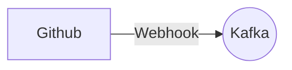

# Connect Kafka to GitHub

Quix helps you integrate Kafka to GitHub using pure Python.

## GitHub

GitHub is a web-based platform that serves as a hub for developers to collaborate on projects by providing tools for version control and project management. Users can create repositories to store code, track changes made by themselves and others, and merge changes seamlessly. GitHub also offers features such as issue tracking, code review, and wikis to facilitate communication and collaboration among team members. In addition, GitHub allows for easy integration with other development tools and services, making it a valuable resource for software development teams to work together efficiently and effectively.

## Integrations

Quix is a good fit for integrating with GitHub because it offers a comprehensive platform with key features that enhance collaboration, streamline development, and provide real-time monitoring capabilities. By integrating with GitHub, developers can leverage the following benefits:

1. Streamlined Development and Deployment: GitHub integration allows for seamless synchronization of code changes, pipelines, and environment variables. This simplifies the creation and deployment of data pipelines, making it easier for teams to collaborate and deploy changes efficiently.

2. Enhanced Collaboration: GitHub's organization and permission management features can be utilized to increase project visibility and control. By leveraging GitHub's collaborative capabilities, teams can work together more effectively and manage pipeline resources with ease.

3. Real-Time Monitoring: Quix Cloud provides tools for real-time logs, metrics, and data exploration. By integrating with GitHub, developers can monitor pipeline performance and critical metrics in real-time, enabling them to quickly identify and address issues as they arise.

4. Flexible Scaling and Management: With GitHub integration, users can easily scale resources, manage CPU and memory, and handle multiple environments linked to Git branches. This allows for efficient resource management and ensures that pipelines can be scaled up or down as needed.

5. Security and Compliance: Quix Cloud ensures secure management of secrets and compliance with dedicated infrastructure options. By integrating with GitHub, developers can maintain secure access control and ensure that pipelines meet compliance requirements.

Overall, integrating Quix with GitHub provides a seamless and efficient development and deployment process for managing real-time data pipelines. By leveraging the collaborative features of GitHub, developers can work together effectively, monitor pipeline performance in real-time, and scale resources with ease.

