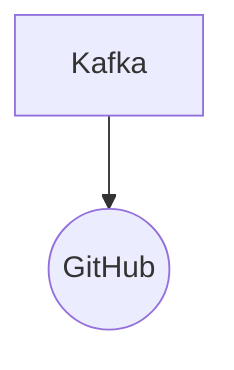

# Connect Kafka to GitHub

Quix helps you integrate Kafka to GitHub using pure Python.

<a class="md-button md-button--primary" href="https://share.hsforms.com/1iW0TmZzKQMChk0lxd_tGiw4yjw2?__hstc=175542013.2303933fbd746c0ac86d9ccbe9bc9100.1728383268831.1729603416735.1729620918855.31&__hssc=175542013.1.1729620918855&__hsfp=2132701734" target="_blank" style="margin-right:.5rem;">Book a demo</a>
 

## GitHub

GitHub is a popular technology platform used by developers for version control and collaboration on software development projects. It allows users to store code in repositories, track changes made by contributors, and facilitate better communication among team members. GitHub also provides a range of tools and features, such as issue tracking, pull requests, and code reviews, to help streamline the development process. With its user-friendly interface and integration with popular development tools, GitHub has become an essential tool for developers looking to work together efficiently and effectively on projects.

## Integrations

Quix is a good fit for integrating with GitHub because it offers a range of features that streamline development, enhance collaboration, and provide real-time monitoring and scaling capabilities, all of which are important aspects of a successful integration with a version control system like GitHub.

Firstly, Quix Cloud's streamlined development and deployment capabilities, such as integrated online code editors and CI/CD tools, make it easy for developers to create and deploy data pipelines efficiently. This aligns well with GitHub's focus on enabling smooth development workflows and version control.

Secondly, the enhanced collaboration features of Quix Cloud, such as organization and permission management, increase project visibility and control, making it easier for teams to work together effectively on GitHub repositories.

Furthermore, Quix Cloud's real-time monitoring tools allow users to monitor pipeline performance and critical metrics, which can be valuable for tracking changes and ensuring the overall health of the integrated projects on GitHub.

Quix's flexible scaling and management capabilities, along with its support for secure management of secrets and compliance, are also important considerations when integrating with GitHub, as they ensure that the integrated workflows are scalable, secure, and compliant with industry standards.

Additionally, Quix Cloud's integration with Git providers like GitHub simplifies CI/CD processes, enabling seamless synchronization via GitHub actions and CLI commands, which is crucial for maintaining a smooth and efficient development pipeline.

Overall, Quix's comprehensive features and seamless integration with GitHub make it a suitable choice for organizations looking to leverage the power of real-time data pipelines while effectively collaborating and managing their projects using GitHub.

