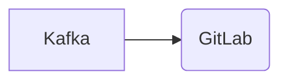

# Connect Kafka to GitLab

Quix helps you integrate Kafka to GitLab using pure Python.

## GitLab

GitLab is a web-based DevOps lifecycle tool that provides a complete solution for managing and tracking code repositories, pipelines, and collaboration for development teams. It allows developers to easily track changes, collaborate on projects, and automate various stages of the software development process. GitLab combines features such as version control, issue tracking, code review, continuous integration/continuous deployment (CI/CD), and more, all within a single platform. This technology enables teams to work more efficiently and effectively, ensuring better code quality, faster development cycles, and seamless project management.

## Integrations

Quix is a good fit for integrating with GitLab for several reasons. Firstly, GitLab provides a robust version control system that allows developers to manage their code base effectively. By integrating Quix with GitLab, developers can easily track changes to their data pipelines, collaborate with team members, and streamline the development and deployment process.

Additionally, GitLab's CI/CD capabilities can be leveraged to automate the testing and deployment of data pipelines created using Quix. This integration can help improve the overall efficiency of the development process and ensure that code changes are thoroughly tested before being deployed to production.

Furthermore, the security and compliance features of Quix Cloud make it a suitable option for organizations looking to maintain a secure and compliant data pipeline infrastructure. By integrating with GitLab, organizations can ensure that their data pipeline code is securely managed and compliant with industry regulations.

Overall, the combination of Quix with GitLab offers a comprehensive solution for developing, deploying, and managing real-time data pipelines with enhanced collaboration, real-time monitoring, and scaling capabilities. This integration can help organizations achieve faster development cycles, improved collaboration, and increased agility in managing their data pipeline infrastructure.

