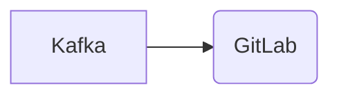

# Connect Kafka to GitLab

Quix helps you integrate Kafka to GitLab using pure Python.

<a class="md-button md-button--primary" href="https://share.hsforms.com/1iW0TmZzKQMChk0lxd_tGiw4yjw2?__hstc=175542013.2303933fbd746c0ac86d9ccbe9bc9100.1728383268831.1729603416735.1729620918855.31&__hssc=175542013.1.1729620918855&__hsfp=2132701734" target="_blank" style="margin-right:.5rem;">Book a demo</a>
 

## GitLab

GitLab is a comprehensive technology platform designed to help developers collaborate effectively on software development projects. It provides a centralized repository where code can be stored, managed, and shared among team members, making it easy to track changes, review code, and ensure smooth integration of contributions. GitLab also offers a suite of tools for project management, issue tracking, and continuous integration. With built-in features such as code review, merge requests, and automated testing, GitLab allows teams to streamline their development process and work more efficiently together. Overall, GitLab is a powerful and versatile technology that empowers developers to deliver high-quality software faster.

## Integrations

Quix is a good fit for integrating with GitLab due to its comprehensive platform designed for developing, deploying, and managing real-time data pipelines. GitLab is a widely used tool for version control and collaboration in software development, making it a natural fit for Quix's streamlined development and deployment features.

The integrated online code editors and CI/CD tools in Quix simplify the creation and deployment of data pipelines, which can be easily managed and tracked through GitLab's version control system. YAML synchronization also allows for defining pipelines and environment variables as code, enabling seamless integration with GitLab's workflows and processes.

Furthermore, Quix Cloud's enhanced collaboration features such as organization and permission management align well with GitLab's focus on improving collaboration and project visibility. This integration can help teams efficiently manage, track, and deploy data pipelines through GitLab, leading to increased productivity and control over projects.

Moreover, Quix's real-time monitoring capabilities for logs, metrics, and data exploration complement GitLab's monitoring and visualization tools, providing users with comprehensive insights into pipeline performance and critical metrics.

In addition, Quix's support for flexible scaling and management, as well as secure management of secrets and compliance with dedicated infrastructure options, aligns well with GitLab's focus on security and scalability. This integration ensures that users can easily scale resources, manage CPU and memory, and handle multiple environments linked to Git branches seamlessly.

Overall, the integration of Quix with GitLab offers a powerful solution for developing, deploying, and managing real-time data pipelines, providing users with a streamlined and collaborative platform to enhance their data processing workflows.

