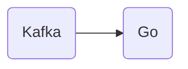

# Connect Kafka to Go

Quix helps you integrate Kafka to Go using pure Python.

## Go

Go, also known as Golang, is a programming language created by Google in 2007. Designed for efficiency and simplicity, Go aims to facilitate rapid development of scalable and reliable software applications. Known for its speed and robustness, Go is often used in building web servers, microservices, and cloud infrastructure. With its static typing and garbage collection features, Go enables developers to write clean and maintainable code. Additionally, Go's language features like goroutines and channels make it ideal for concurrent programming, allowing developers to easily handle multiple tasks at once. Overall, Go is a versatile and powerful technology that continues to gain popularity in the software development community.

## Integrations

Quix is a good fit for integrating with the technology called Go because Go is a modern programming language known for its speed, efficiency, and simplicity. Quix Streams' cloud-native library for processing data in Kafka using Python can easily complement Go's capabilities in terms of handling real-time data pipelines.

By leveraging Python for data processing with Quix Streams and Go for other parts of the data pipeline or application development, developers can benefit from the best of both worlds. Python offers a user-friendly interface, while Go provides powerful concurrency features and performance optimizations.

Additionally, Quix Cloud's features such as streamlined development and deployment, enhanced collaboration, real-time monitoring, and flexible scaling and management can complement Go's strengths in building scalable and high-performance applications.

Overall, integrating Quix with Go can help developers build robust, efficient, and reliable real-time data pipelines and applications that meet the demands of today's data-driven world.

