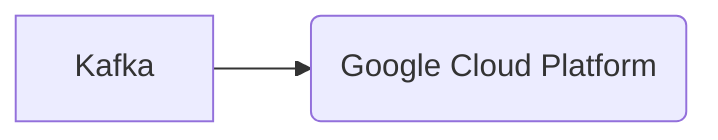

# Connect Kafka to Google Cloud Platform

Quix helps you integrate Kafka to Google Cloud Platform using pure Python.

## Google Cloud Platform

Google Cloud Platform is a suite of cloud computing services that offer a wide range of products and features to help businesses build, deploy, and scale applications and other services. It provides computing power, storage, and networking capabilities, as well as data analytics and machine learning tools. With Google Cloud Platform, users can host websites, run virtual machines, store and analyze data, and build custom machine learning models. It is known for its reliability, scalability, and security, making it a popular choice for businesses looking to move their operations to the cloud.

## Integrations

Quix is a good fit for integrating with Google Cloud Platform due to the following reasons:

1. Scalability: Both Quix Streams and Quix Cloud are designed for scalable data processing, making them a natural fit for Google Cloud Platform's scalable infrastructure. Google Cloud Platform offers services like Google Kubernetes Engine (GKE) for container orchestration, allowing for easy scaling of resources as needed.

2. Integration with Kafka: Quix Streams specifically focuses on processing data in Kafka using Python, which complements Google Cloud Platform's support for Kafka integration. Google Cloud Pub/Sub can be used as a messaging service to ingest data into Kafka, providing a seamless integration for processing with Quix Streams.

3. Real-time Monitoring and Logging: Both Quix Streams and Quix Cloud offer real-time monitoring capabilities, which align with Google Cloud Platform's emphasis on real-time data processing and analysis. Google Cloud's monitoring and logging services can be used in conjunction with Quix's monitoring tools to provide comprehensive insights into pipeline performance.

4. Security and Compliance: Quix Cloud's emphasis on security and compliance aligns well with Google Cloud Platform's robust security features and compliance certifications. By integrating with Google Cloud Platform, users can benefit from the platform's security measures, ensuring that data pipelines are protected and compliant with regulations.

Overall, the combination of Quix with Google Cloud Platform provides a powerful solution for developing, deploying, and managing real-time data pipelines in a secure and scalable manner.

