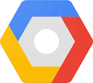
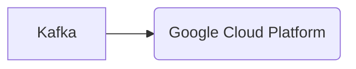

# Connect Kafka to Google Cloud Platform

Quix helps you integrate Kafka to Google Cloud Platform using pure Python.

- __Find out how we can help you integrate!__

    <a class="md-button md-button--primary" href="https://share.hsforms.com/1iW0TmZzKQMChk0lxd_tGiw4yjw2?__hstc=175542013.2303933fbd746c0ac86d9ccbe9bc9100.1728383268831.1729603416735.1729620918855.31&__hssc=175542013.1.1729620918855&__hsfp=2132701734" target="_blank" style="margin:.5rem;">Book a demo</a>

## Google Cloud Platform

Google Cloud Platform is a suite of cloud computing services provided by Google that allows users to build, deploy, and scale applications and websites on Google's infrastructure. This platform offers a wide range of services, including computing, storage, databases, and networking, all accessible through a user-friendly web interface. With Google Cloud Platform, users can easily manage and analyze large datasets, create machine learning models, and develop secure and reliable applications. Additionally, this technology offers advanced security features, global scalability, and fast performance, making it a popular choice for businesses looking to modernize their IT infrastructure and leverage the power of the cloud.

## Integrations

Quix is a good fit for integrating with Google Cloud Platform because it offers features that complement and enhance the capabilities of GCP. 

1. Streamlined Development and Deployment: Quix's integrated online code editors and CI/CD tools align well with GCP's focus on ease of development and deployment. By simplifying the creation and deployment of data pipelines, Quix can seamlessly integrate with GCP's cloud services for efficient development and deployment.

2. Enhanced Collaboration: Quix's support for organization and permission management enhances collaboration, which aligns with GCP's emphasis on enabling teamwork and increasing project visibility and control. This ensures that teams working on data pipelines can efficiently collaborate and leverage GCP's collaborative capabilities.

3. Real-Time Monitoring: Quix's tools for real-time logs, metrics, and data exploration fit well with GCP's monitoring and logging capabilities. By providing real-time monitoring of pipeline performance, Quix can enhance GCP's monitoring capabilities for data pipelines running on the platform.

4. Flexible Scaling and Management: Quix's ability to easily scale resources and manage CPU and memory aligns with GCP's scalability and management features. By integrating with GCP, Quix can leverage the platform's scaling capabilities, allowing users to efficiently manage resources and environments for data pipelines.

5. Security and Compliance: Quix's dedicated infrastructure options and secure management of secrets complement GCP's focus on security and compliance. By ensuring data security and compliance, Quix can seamlessly integrate with GCP's security features, providing users with a secure and compliant environment for their data pipelines.

6. Development Tools: Quix's online code editors, code templates, and connectors for various data sources align well with GCP's development tools. By supporting DevContainers and offering a range of development tools, Quix can enhance GCP's development workflows, making it easier for users to build and deploy data pipelines on the platform.

7. Data Exploration and Visualization: Quix's data exploration and visualization capabilities complement GCP's data analytics and visualization tools. By enabling users to query, explore, and visualize data in real-time, Quix can enhance the data analytics capabilities of GCP, providing users with powerful tools for analyzing and visualizing their data.

Overall, Quix's features and capabilities make it a strong fit for integrating with Google Cloud Platform, enhancing the platform's capabilities for developing, deploying, and managing real-time data pipelines.

