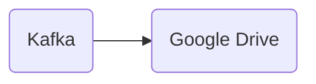

# Connect Kafka to Google Drive

Quix helps you integrate Kafka to Google Drive using pure Python.

## Google Drive

Google Drive is a cloud-based storage and file-sharing platform developed by Google. It allows users to store files, documents, and photos online, and access them from any device with an internet connection. Users can create, edit, and collaborate on files in real-time with others, making it a convenient tool for team projects and remote work. Google Drive also offers seamless integration with other Google services, such as Gmail and Google Docs, making it easy to save and share files directly from these applications. With generous storage space and robust security features, Google Drive is a versatile and reliable solution for file management and collaboration.

## Integrations

Quix are good fits for integrating with Google Drive because they offer a comprehensive platform for developing, deploying, and managing real-time data pipelines. Quix Streams, specifically designed for processing data in Kafka using Python, can easily integrate with Google Drive for data storage and retrieval.

With its Python Ecosystem Integration, Quix Streams can work seamlessly with libraries like Pandas, making it easier to interact with data stored in Google Drive. Additionally, its Serialization and State Management capabilities support various serialization formats, allowing for efficient data transfer between Quix Streams and Google Drive.

Moreover, Quix Streams' Resilient Scaling feature, designed to run and scale via container orchestration, ensures that the integration with Google Drive can handle a large volume of data without compromising performance.

Overall, the streamlined development and deployment, enhanced collaboration, real-time monitoring, and scalable management capabilities of Quix make them ideal choices for integrating with Google Drive, providing a robust and efficient solution for data processing and storage.

