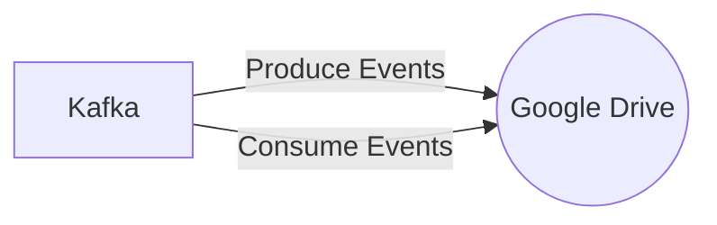

# Connect Kafka to Google Drive

Quix helps you integrate Kafka to Google Drive using pure Python.

- __Find out how we can help you integrate!__

    <a class="md-button md-button--primary" href="https://share.hsforms.com/1iW0TmZzKQMChk0lxd_tGiw4yjw2?__hstc=175542013.2303933fbd746c0ac86d9ccbe9bc9100.1728383268831.1729603416735.1729620918855.31&__hssc=175542013.1.1729620918855&__hsfp=2132701734" target="_blank" style="margin:.5rem;">Book a demo</a>

## Google Drive

Google Drive is a cloud-based storage platform that allows users to store and access files from any device with an internet connection. Users can store documents, photos, videos, and more in Google Drive, and easily share them with others through email or by generating a link. Google Drive also includes the ability to create and edit documents, spreadsheets, and presentations directly within the platform using Google Docs, Sheets, and Slides. Additionally, Google Drive offers seamless integration with other Google products, such as Gmail and Google Photos, making it a versatile and convenient tool for both personal and professional use. With abundant storage capacity, robust security features, and user-friendly interface, Google Drive is a reliable and efficient solution for managing and collaborating on digital files.

## Integrations

Quix is a good fit for integrating with Google Drive because of its comprehensive platform designed for developing, deploying, and managing real-time data pipelines. 

1. Streamlined Development and Deployment: Integrated online code editors and CI/CD tools in Quix make it easy to create and deploy data pipelines. This feature can complement the collaboration tools in Google Drive, allowing for seamless development and deployment processes.

2. Enhanced Collaboration: Quix's organization and permission management features enhance collaboration, which can be beneficial for teams working on data pipelines stored in Google Drive. This integration can increase project visibility and control for all team members.

3. Real-Time Monitoring: Quix Cloud's tools for real-time logs and metrics can be useful for monitoring pipeline performance when working with data stored in Google Drive. This feature ensures that users can track critical metrics and troubleshoot issues promptly.

4. Flexible Scaling and Management: Quix Cloud allows users to scale resources and manage CPU and memory efficiently. When integrated with Google Drive, this feature ensures that data pipelines can handle large volumes of data stored in the cloud.

5. Security and Compliance: Quix Cloud ensures secure management of secrets and compliance with dedicated infrastructure options and SLAs, providing peace of mind when working with sensitive data stored in Google Drive.

Overall, Quix's features such as streamlined development and deployment, enhanced collaboration, real-time monitoring, flexible scaling and management, and security and compliance make it a good fit for integrating with Google Drive for developing and managing data pipelines. Additionally, Quix Streams, with its cloud-native library for processing data in Kafka using Python, can enhance the capabilities of Google Drive for data analysis and visualization.

