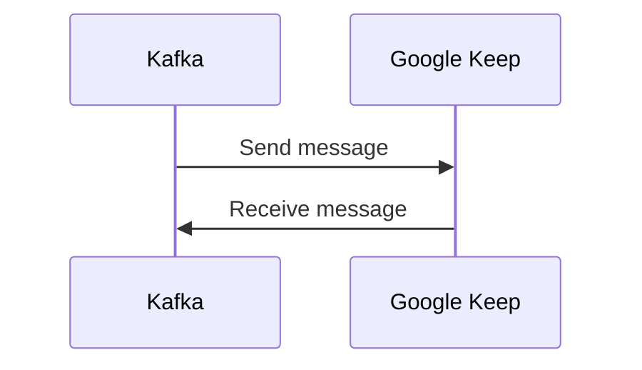

# Connect Kafka to Google Keep

Quix helps you integrate Kafka to Google Keep using pure Python.

## Google Keep

Google Keep is a powerful and versatile note-taking app that allows users to keep track of their thoughts, ideas, and to-do lists in a simple and intuitive interface. With Google Keep, users can create notes, set reminders, and even collaborate with others in real-time. The app also offers the ability to add images, drawings, and audio recordings to notes, making it a dynamic tool for capturing and organizing information. Users can access Google Keep across multiple devices, sync their notes seamlessly, and search for specific information easily. Overall, Google Keep is a convenient and efficient tool for staying organized and productive in both personal and professional settings.

## Integrations

Quix is a good fit for integrating with Google Keep because of its real-time data processing capabilities, flexibility in scaling resources, and seamless integration with other technologies. 

Since Google Keep is a note-taking app that allows users to capture and organize their thoughts in real-time, having a platform like Quix that can process and analyze data in real-time would be advantageous. Quix Streams' ability to aggregate data over time windows and its support for serialization and state management align well with the need to capture and process real-time data from Google Keep.

Additionally, the flexible scaling and management features of Quix Cloud would allow for the efficient handling of varying data loads from Google Keep, ensuring that the system can adapt to fluctuations in user activity. The platform's integration with Git providers also supports seamless CI/CD processes, enabling easy deployment of changes and updates to the data pipelines.

Furthermore, the development tools provided by Quix Cloud, such as online code editors and connectors for various data sources, would streamline the development and deployment of pipelines for integrating with Google Keep. This, coupled with the platform's security features for managing secrets and compliance, ensures that data from Google Keep is handled securely and in accordance with best practices.

In conclusion, the features and capabilities offered by Quix make it well-suited for integrating with Google Keep, providing a comprehensive solution for processing and analyzing real-time data from the note-taking app.

