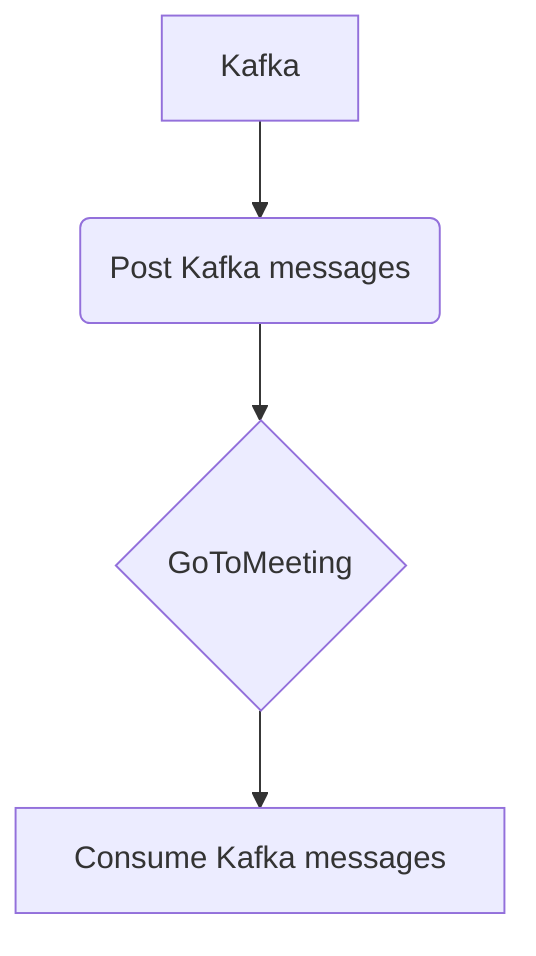

# Connect Kafka to GoToMeeting

Quix helps you integrate Kafka to GoToMeeting using pure Python.

## GoToMeeting

GoToMeeting is a web-based platform that enables users to conduct virtual meetings, webinars, and online collaboration sessions from anywhere with an internet connection. It offers a variety of features including video conferencing, screen sharing, and file sharing to facilitate real-time communication and collaboration among participants. With GoToMeeting, users can schedule and host meetings easily, invite participants via email or calendar invites, and record meetings for future reference. The platform is user-friendly and provides a reliable and secure environment for virtual meetings, making it a popular choice for businesses and organizations looking to connect with remote teams or clients.

## Integrations

Quix is a good fit for integrating with GoToMeeting because it provides a robust platform for developing, deploying, and managing real-time data pipelines. With its streamlined development and deployment tools, Quix makes it easy to create and deploy data pipelines quickly and efficiently. This can be especially useful when integrating with a technology like GoToMeeting, where real-time data processing and monitoring are essential.

Additionally, Quix Cloud offers enhanced collaboration capabilities, allowing for efficient project management and organization. This feature can be beneficial when working with a technology like GoToMeeting, as it can help teams stay organized and on track when processing and analyzing meeting data.

Quix Cloud's real-time monitoring tools are also valuable when integrating with GoToMeeting, as they provide the ability to monitor pipeline performance and critical metrics in real-time. This can help ensure that data is being processed accurately and efficiently, which is crucial when working with a technology like GoToMeeting where timely data processing is essential.

Overall, Quix's comprehensive platform, with features such as flexible scaling, security and compliance measures, development tools, and data exploration capabilities, make it a strong choice for integrating with technologies like GoToMeeting that require efficient and reliable data processing and monitoring.

