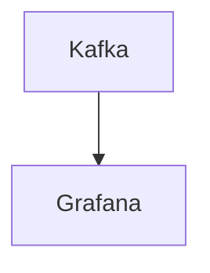

# Connect Kafka to Grafana

Quix helps you integrate Kafka to Grafana using pure Python.

## Grafana

Grafana is a powerful open-source data visualization and monitoring platform that allows users to create, explore, and share interactive dashboards and graphs in real-time. It integrates with a wide range of data sources such as databases, cloud services, and monitoring tools, enabling users to visualize and analyze their data in a customizable and dynamic way. Grafana's intuitive user interface and extensive library of plugins make it easy for users to create visually appealing and informative dashboards that can help them monitor system performance, track key metrics, and gain valuable insights into their data. Its flexibility and scalability make it a popular choice for organizations looking to improve their data monitoring and analytics capabilities.

## Integrations

Integrating Quix with Grafana is a good fit because Grafana is a powerful data visualization and monitoring tool that can provide valuable insights into the performance of data pipelines and systems. By integrating with Grafana, users can easily monitor real-time metrics, logs, and data exploration provided by Quix. This allows for better visibility into pipeline performance, resource utilization, and critical metrics, enabling users to make informed decisions and optimize their data processing workflows.

Additionally, Grafana's flexible scaling and management capabilities can be leveraged with Quix to easily scale resources, manage CPU and memory, and handle multiple environments. Users can create custom dashboards in Grafana to visualize data from Quix Cloud pipelines, monitor system health, and track key performance indicators. This integration enhances collaboration and improves overall efficiency by providing a centralized platform for monitoring and analyzing data pipeline performance.

Furthermore, Grafana's robust CI/CD processes can be seamlessly integrated with Quix, enabling users to automate deployment and monitoring tasks. The dedicated infrastructure options and SLAs provided by Quix Cloud ensure secure management of secrets and compliance with data security standards, making it a suitable choice for organizations with stringent security requirements.

Overall, integrating Quix with Grafana enhances the monitoring and visualization capabilities of data pipelines, streamlining development, improving collaboration, and providing valuable insights for optimizing real-time data processing workflows.

