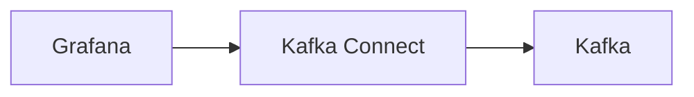

# Connect Kafka to Grafana

Quix helps you integrate Kafka to Grafana using pure Python.

- __Find out how we can help you integrate!__

    <a class="md-button md-button--primary" href="https://share.hsforms.com/1iW0TmZzKQMChk0lxd_tGiw4yjw2?__hstc=175542013.2303933fbd746c0ac86d9ccbe9bc9100.1728383268831.1729603416735.1729620918855.31&__hssc=175542013.1.1729620918855&__hsfp=2132701734" target="_blank" style="margin:.5rem;">Book a demo</a>

## Grafana

Grafana is an open-source, web-based data visualization tool that allows users to create, edit, and share interactive dashboards. It is commonly used for monitoring and analyzing metrics in real-time, with support for a wide range of data sources including databases, cloud services, and time series databases. Grafana's user-friendly interface makes it easy to customize and fine-tune dashboards, enabling users to quickly identify trends, anomalies, and performance issues. With its support for plugins and a robust community, Grafana is a versatile tool that can be tailored to meet the specific needs of any organization or industry.

## Integrations

Quix is a good fit for integrating with Grafana because it complements Grafana's capabilities by providing a comprehensive platform for developing, deploying, and managing real-time data pipelines. With its streamlined development and deployment features, Quix simplifies the creation and deployment of data pipelines, making it easier for users to connect their data sources to Grafana for visualization and monitoring.

Additionally, Quix's real-time monitoring tools enable users to monitor pipeline performance and critical metrics, which can be visualized in Grafana dashboards for enhanced visibility. Quix also supports flexible scaling and management, allowing users to easily scale resources and manage CPU and memory usage, which can be visualized and monitored in Grafana.

Furthermore, Quix's integration with Kafka, including Quix-hosted and third-party solutions, enables seamless data processing and streaming capabilities that can be visualized and monitored in Grafana dashboards. Overall, the combination of Quix's advanced features and Grafana's visualization and monitoring capabilities make it a powerful and efficient solution for organizations looking to manage and monitor their real-time data pipelines.

