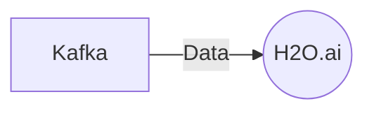

# Connect Kafka to H2O.ai

Quix helps you integrate Kafka to H2O.ai using pure Python.

## H2O.ai

H2O.ai is a leading artificial intelligence and machine learning platform that leverages the power of automation to help organizations unleash the full potential of their data. With its innovative autoML capabilities, H2O.ai enables users to quickly build and deploy machine learning models without the need for specialized programming or data science knowledge. By combining automation with cutting-edge algorithms, H2O.ai empowers businesses to make data-driven decisions and drive operational efficiency. With H2O.ai, organizations can harness the power of AI to transform their business processes and drive innovation.

## Integrations

Integrating Quix with H2O.ai technology is a good fit because it enables users to leverage the scalability and real-time processing capabilities of Quix Streams with the advanced machine learning and AI capabilities of H2O.ai.

H2O.ai is a leading open-source platform for AI and machine learning, offering cutting-edge algorithms and tools for data analysis and predictive modeling. By integrating Quix with H2O.ai, users can easily ingest and process real-time data streams from Kafka using Quix Streams, and then leverage the machine learning capabilities of H2O.ai to build and deploy predictive models in real-time.

Quix Streams' support for serialization and state management, time window aggregations, and resilient scaling makes it a perfect companion for H2O.ai, allowing users to preprocess and manipulate data efficiently before feeding it into H2O.ai's algorithms. Additionally, the Python ecosystem integration of Quix Streams aligns well with H2O.ai's Python APIs, enabling seamless integration and collaboration between the two technologies.

Overall, integrating Quix with H2O.ai provides users with a comprehensive end-to-end solution for building real-time data pipelines, processing complex data streams, and deploying advanced machine learning models, making it a powerful combination for any organization looking to harness the power of real-time data analytics and AI.

