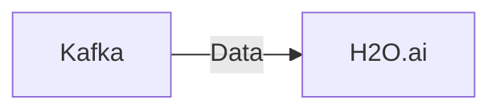

# Connect Kafka to H2O.ai

Quix helps you integrate Kafka to H2O.ai using pure Python.

<a class="md-button md-button--primary" href="https://share.hsforms.com/1iW0TmZzKQMChk0lxd_tGiw4yjw2?__hstc=175542013.2303933fbd746c0ac86d9ccbe9bc9100.1728383268831.1729603416735.1729620918855.31&__hssc=175542013.1.1729620918855&__hsfp=2132701734" target="_blank" style="margin-right:.5rem;">Book a demo</a>
 

## H2O.ai

H2O.ai is a cutting-edge technology platform that specializes in artificial intelligence and machine learning. It provides tools and solutions for organizations to build and deploy machine learning models, allowing them to harness the power of data and make informed decisions. H2O.ai offers a user-friendly interface that simplifies the process of creating and training models, making it accessible even to those with limited technical expertise. With its advanced algorithms and efficient computational capabilities, H2O.ai enables businesses to optimize their operations, improve performance, and drive innovation in a rapidly evolving digital landscape.

## Integrations

Quix is a good fit for integrating with H2O.ai because it provides a comprehensive platform for developing, deploying, and managing real-time data pipelines. H2O.ai is a technology that specializes in machine learning and AI, and by integrating with Quix, organizations can streamline the development and deployment of data pipelines that are crucial for training and deploying machine learning models.

The key components of Quix, such as streamlined development and deployment, enhanced collaboration, real-time monitoring, flexible scaling and management, security and compliance, development tools, data exploration and visualization, robust CI/CD processes, and Kafka integration, align well with the capabilities of H2O.ai. Quix provides a user-friendly interface and tools that can integrate seamlessly with H2O.ai libraries and workflows.

Additionally, Quix Streams, a cloud-native library for processing data in Kafka using Python, complements the scalability and ease of use provided by H2O.ai. The integration of Quix Streams with H2O.ai allows for efficient data processing and model training using Python, without the need for a server-side engine or orchestrator. This integration ensures that organizations can leverage the capabilities of both Quix and H2O.ai to build, deploy, and manage machine learning models effectively.

Overall, the combination of Quix and H2O.ai offers organizations a powerful solution for developing and deploying machine learning models, with efficient data processing, real-time monitoring, and seamless integration between different technologies.

