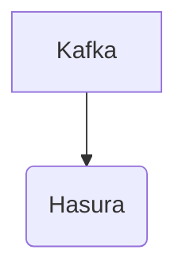

# Connect Kafka to Hasura

Quix helps you integrate Kafka to Hasura using pure Python.

## Hasura

Hasura is a powerful technology that allows developers to instantly turn their databases into a real-time GraphQL API. With Hasura, developers can easily build scalable and high-performance APIs without writing any code. This technology offers features such as instant data synchronization, real-time notifications, and powerful access control. Hasura also provides an intuitive interface for managing data relationships and permissions, making it easy for developers to customize and secure their APIs. Overall, Hasura is a game-changing tool that helps developers streamline their workflows and build robust applications quickly and efficiently.

## Integrations

Quix is a good fit for integrating with Hasura because both platforms offer key components that align well with the needs of modern data pipeline development and management. 

1. Streamlined Development and Deployment: Hasura can benefit from Quix Cloud's integrated online code editors and CI/CD tools to simplify the creation and deployment of data pipelines, aligning with the agile development approach of Hasura.

2. Enhanced Collaboration: Quix Cloud's features for efficient collaboration, organization, and permission management can help Hasura teams increase project visibility and control, improving overall productivity and teamwork.

3. Real-Time Monitoring: The real-time monitoring tools provided by Quix Cloud can be useful for Hasura to monitor pipeline performance and critical metrics in real-time, enabling quick intervention and troubleshooting if needed.

4. Flexible Scaling and Management: Quix Cloud's ability to easily scale resources, manage CPU and memory, and handle multiple environments can complement Hasura's need for flexible scaling options and resource management.

5. Security and Compliance: The secure management of secrets and compliance features of Quix Cloud can ensure that data pipelines integrated with Hasura are effectively managed and compliant with security standards.

Overall, the combination of Quix with Hasura can provide developers and data engineers with a comprehensive platform for developing, deploying, and managing real-time data pipelines that are efficient, scalable, and secure.

