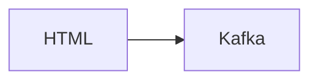

# Connect Kafka to HTML

Quix helps you integrate Kafka to HTML using pure Python.

## HTML

HTML stands for Hypertext Markup Language and is the standard language used for creating and designing web pages. It is a fundamental technology that helps to structure content on the internet by defining elements such as headings, paragraphs, images, links, and much more. HTML uses tags to define the various elements on a web page, and these tags are interpreted by web browsers to display the content in a visually appealing way. HTML is a crucial element of web development and is often used in conjunction with CSS and JavaScript to create dynamic and interactive websites. It is a powerful tool that allows developers to create innovative and engaging online experiences for users.

## Integrations

Quix Streams and Quix Cloud are both excellent options for integrating with HTML due to several key factors:

1. Streamlined Development and Deployment: Both platforms offer integrated online code editors and CI/CD tools that make it easier to develop and deploy data pipelines. This aligns well with the HTML technology stack, which also emphasizes speed and efficiency in development.

2. Real-Time Monitoring: Quix Streams and Quix Cloud provide tools for real-time monitoring of pipeline performance, metrics, and critical data. This real-time monitoring capability is essential for HTML applications requiring fast, responsive feedback and data visualization.

3. Collaboration and Security: Collaboration features in Quix Cloud, such as organization and permission management, help foster teamwork among developers and stakeholders. Additionally, the security and compliance measures in both platforms ensure that sensitive data is protected, which is crucial when working with HTML applications handling user data.

4. Data Exploration and Visualization: The ability to query, explore, and visualize data in real-time using Quix Cloud and Quix Streams aligns well with HTML applications that often require interactive and dynamic data visualization for a rich user experience.

5. Flexible Scaling: Both platforms offer flexible scaling options, allowing users to easily adjust resources and manage multiple environments. This scalability is important for HTML applications that may need to handle varying loads and data volumes.

In summary, Quix Streams and Quix Cloud's features, such as streamlined development, real-time monitoring, collaboration tools, data exploration, and flexible scaling, make them well-suited for integrating with HTML technology, enabling developers to build robust, scalable, and efficient applications.

