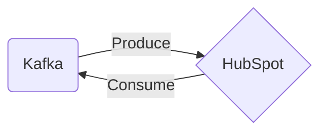

# Connect Kafka to HubSpot

Quix helps you integrate Kafka to HubSpot using pure Python.

## HubSpot

HubSpot is an all-in-one marketing automation platform that helps businesses attract, engage, and delight customers. It offers a wide range of tools and features, including blogging, social media management, email marketing, lead management, analytics, and more. HubSpot's software is designed to streamline marketing efforts and improve overall efficiency by providing a central hub for all marketing activities. With its user-friendly interface and robust capabilities, HubSpot is a popular choice for businesses looking to grow their online presence and increase customer engagement.

## Integrations

Quix is a good fit for integrating with HubSpot because of its real-time data processing capabilities and its ease of use for Python developers. HubSpot is a popular marketing automation platform that relies on real-time data to provide insights and drive decisions for marketing campaigns. By integrating Quix with HubSpot, users can easily process and analyze real-time data from various sources, such as social media, website analytics, and customer interactions.

Quix Streams' scalability and resilience make it well-suited for handling large volumes of data, which is crucial for businesses using HubSpot for marketing and customer relationship management. Additionally, Quix Streams' integration with the Python ecosystem allows for seamless connection with libraries commonly used by data scientists and analysts, enabling advanced data processing and analysis within HubSpot.

Furthermore, Quix Streams' support for time window aggregations and stateful operations makes it a valuable tool for processing and analyzing streaming data, providing HubSpot users with the ability to derive real-time insights and make data-driven decisions for their marketing strategies.

Overall, integrating Quix with HubSpot can enhance the platform's capabilities by enabling real-time data processing, advanced analysis, and scalable data pipelines, ultimately improving marketing performance and decision-making.

