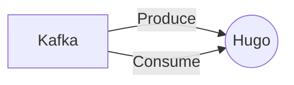

# Connect Kafka to Hugo

Quix helps you integrate Kafka to Hugo using pure Python.

## Hugo

Hugo is a cutting-edge artificial intelligence technology that is revolutionizing the way businesses interact with their customers. Using advanced natural language processing algorithms, Hugo is able to understand and respond to customer inquiries in real-time, providing accurate and personalized solutions to a wide range of issues. Hugo can be integrated seamlessly into existing customer service systems, helping businesses streamline their operations and improve customer satisfaction. With its ability to learn and adapt over time, Hugo is constantly evolving to meet the changing needs of both businesses and their customers. This innovative technology is quickly becoming a game-changer in the world of customer service, offering an unprecedented level of efficiency and effectiveness in resolving customer issues.

## Integrations

Quix Streams is a good fit for integrating with Hugo technology because of its cloud-native approach to processing data in Kafka using Python. Hugo, a static site generator, focuses on speed and flexibility, making it a popular choice for websites and blogs.

By integrating Quix Streams with Hugo, users can benefit from its streamlined development and deployment features, enhanced collaboration capabilities, real-time monitoring and scaling abilities, as well as security and compliance measures. Quix Streams' support for various serialization formats, time window aggregations, and resilient scaling make it well-suited for processing and managing data efficiently.

Additionally, Quix Streams' integration with Kafka aligns with Hugo's focus on speed and performance, allowing for seamless data processing and analysis within the Hugo framework. Overall, the combination of Quix Streams and Hugo offers a powerful solution for developers looking to leverage real-time data pipelines in their Hugo projects while ensuring efficiency, scalability, and security.

