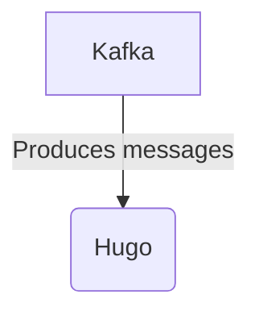

# Connect Kafka to Hugo

Quix helps you integrate Kafka to Hugo using pure Python.

<a class="md-button md-button--primary" href="https://share.hsforms.com/1iW0TmZzKQMChk0lxd_tGiw4yjw2?__hstc=175542013.2303933fbd746c0ac86d9ccbe9bc9100.1728383268831.1729603416735.1729620918855.31&__hssc=175542013.1.1729620918855&__hsfp=2132701734" target="_blank" style="margin-right:.5rem;">Book a demo</a>
 

## Hugo

Hugo is a cutting-edge technology developed by a team of innovative engineers and scientists. It is a sophisticated artificial intelligence system that utilizes advanced machine learning algorithms to perform a wide range of tasks efficiently and accurately. Hugo is capable of analyzing vast amounts of data, making complex predictions, and providing valuable insights to support decision-making processes. Its capabilities extend beyond traditional AI systems, as it can adapt and learn from new information in real time, constantly improving its performance. Hugo has the potential to revolutionize industries such as healthcare, finance, and logistics, offering businesses a competitive edge and enabling them to achieve greater success in a rapidly evolving digital landscape.

## Integrations

Quix is a good fit for integrating with the technology called Hugo because Quix Cloud offers a wide range of features that align well with the capabilities of Hugo. Here are a few reasons why Quix is a suitable choice for integrating with Hugo:

1. Streamlined Development and Deployment: Quix Cloud provides integrated online code editors and CI/CD tools that simplify the creation and deployment of real-time data pipelines. This aligns well with Hugo's goal of making it easier for developers to build and deploy websites.

2. Enhanced Collaboration: Quix Cloud supports efficient collaboration through organization and permission management, which can help teams using Hugo to work together more effectively.

3. Real-Time Monitoring: Quix Cloud offers tools for real-time monitoring of pipeline performance and critical metrics, which can be valuable for Hugo users who want to ensure their websites are running smoothly.

4. Flexible Scaling and Management: Quix Cloud makes it easy to scale resources and manage environments, which can benefit Hugo users who need to handle varying levels of web traffic.

5. Security and Compliance: Quix Cloud ensures secure management of secrets and compliance with dedicated infrastructure options, which can be important for Hugo users who need to protect sensitive data.

6. Development Tools: Quix Cloud includes online code editors and connectors for various data sources, supporting a seamless workflow for Hugo users who want to quickly and easily update their websites.

Overall, the features and capabilities of Quix Cloud make it a strong fit for integrating with Hugo, providing a comprehensive platform for developing, deploying, and managing real-time data pipelines that can enhance the efficiency and effectiveness of Hugo users.

