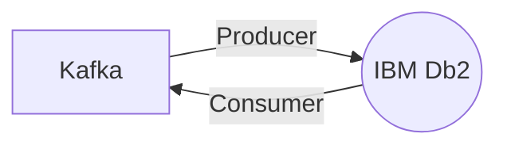

# Connect Kafka to IBM Db2

Quix helps you integrate Kafka to IBM Db2 using pure Python.

## IBM Db2

IBM Db2 is a powerful and versatile relational database management system that has been developed and refined over the years to provide robust and reliable data storage and retrieval capabilities. With its advanced features such as data compression, encryption, and workload management, Db2 allows organizations to efficiently manage and analyze their vast amounts of data with ease. Db2 also supports advanced analytics and artificial intelligence integration, making it a valuable tool for businesses looking to harness the power of data-driven insights. Overall, IBM Db2 is a cutting-edge technology that empowers organizations to make better decisions and drive innovation through intelligent data management.

## Integrations

Quix Streams and Quix Cloud are well-suited for integrating with IBM Db2 due to the following reasons:

1. Streamlined Development and Deployment: Both Quix Streams and Quix Cloud offer integrated online code editors and CI/CD tools that simplify the creation and deployment of data pipelines. This can significantly reduce the time and effort required to integrate with IBM Db2, making the process more efficient and manageable.

2. Real-Time Monitoring: Quix Cloud provides tools for real-time monitoring, allowing users to track pipeline performance and critical metrics. When integrating with IBM Db2, real-time monitoring ensures that any potential issues are quickly identified and resolved, helping to maintain the overall health and performance of the integration.

3. Flexible Scaling and Management: With Quix Cloud, users can easily scale resources and manage CPU and memory, which is essential for handling the large volumes of data typically processed by IBM Db2. This flexibility ensures that the integration can efficiently handle varying workloads and demands, resulting in optimal performance.

4. Security and Compliance: Quix Cloud ensures secure management of secrets and compliance with dedicated infrastructure options and SLAs. When integrating with IBM Db2, ensuring data security and compliance is crucial, and Quix Cloud's dedicated infrastructure options provide a secure environment for managing sensitive data.

5. Kafka Integration: Quix Cloud supports both Quix-hosted and third-party Kafka solutions, including Confluent Cloud and Redpanda. This integration with Kafka can be particularly valuable when working with IBM Db2, as it allows for seamless data transfer and processing between the two systems.

Overall, the features and capabilities offered by Quix Streams and Quix Cloud make them excellent choices for integrating with technology like IBM Db2. Their streamlined development and deployment processes, real-time monitoring capabilities, flexible scaling options, and robust security measures all contribute to a successful and efficient integration with IBM Db2.

