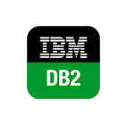
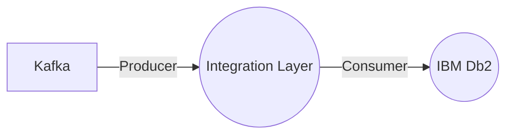

# Connect Kafka to IBM Db2

Quix helps you integrate Kafka to IBM Db2 using pure Python.

<a class="md-button md-button--primary" href="https://share.hsforms.com/1iW0TmZzKQMChk0lxd_tGiw4yjw2?__hstc=175542013.2303933fbd746c0ac86d9ccbe9bc9100.1728383268831.1729603416735.1729620918855.31&__hssc=175542013.1.1729620918855&__hsfp=2132701734" target="_blank" style="margin-right:.5rem;">Book a demo</a>
 

## IBM Db2

IBM Db2 is a robust and highly reliable relational database management system developed by IBM. It is known for its advanced features such as data compression, row and column-level access control, and comprehensive support for SQL queries. Db2 is designed to handle large volumes of data and provide high performance, scalability, and availability. It supports various platforms including Linux, Unix, and Windows. With built-in tools for data analytics and real-time insights, IBM Db2 is a popular choice for businesses looking to manage their data efficiently and securely.

## Integrations

Quix is a good fit for integrating with IBM Db2 because it offers a comprehensive platform for developing, deploying, and managing real-time data pipelines. With features such as streamlined development and deployment, enhanced collaboration, real-time monitoring and scaling capabilities, Quix can easily integrate with IBM Db2 to efficiently process and manage data.

Quix's support for organization and permission management ensures that teams can collaborate effectively and have visibility and control over the project. Additionally, its real-time monitoring tools allow users to monitor pipeline performance and critical metrics, which is essential for managing data in a system like IBM Db2.

Moreover, Quix's flexible scaling and management options make it easy to scale resources and manage multiple environments linked to Git branches, which can be beneficial when integrating with a complex data storage system like IBM Db2.

Furthermore, Quix's integration with Git providers, robust CI/CD processes, and support for Kafka integration make it a versatile platform for working with various data sources and sinks, including IBM Db2. Its dedicated infrastructure options and security features also ensure compliance with industry standards and secure management of data.

In addition, Quix Streams, a cloud-native library for processing data in Kafka using Python, can further enhance the integration with IBM Db2 by providing serialization and state management capabilities, time window aggregations, and support for container orchestration for resilient scaling.

Overall, Quix's comprehensive features and support for real-time data processing make it a suitable choice for integrating with IBM Db2 to effectively manage and process data in a seamless and efficient manner.

