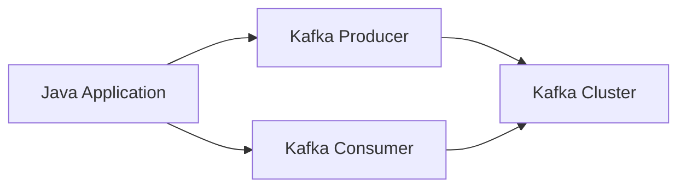

# Connect Kafka to Java

Quix helps you integrate Kafka to Java using pure Python.

## Java

Java is a high-level, object-oriented programming language that was developed by Sun Microsystems in 1991 and released to the public in 1995. It is known for its versatility, as it can be used to develop a wide range of applications, from simple web applications to complex enterprise systems. Java is platform-independent, meaning it can run on any device that has a Java Virtual Machine installed. This feature has made Java one of the most popular programming languages in the world. Additionally, Java has a large standard library that provides developers with a comprehensive set of tools for building applications efficiently.

## Integrations

Quix is a good fit for integrating with Java due to several reasons:

1. Interoperability: Java is a widely used programming language in the industry, and many organizations have existing Java applications and libraries. Integrating Quix with Java allows developers to leverage their Java expertise and seamlessly incorporate real-time data pipelines into their Java-based systems.

2. Streamlined Development: Quix Streams and Quix Cloud offer streamlined development processes, with online code editors and CI/CD tools that simplify the creation and deployment of data pipelines. This aligns well with Java's focus on robust development practices and continuous integration.

3. Real-Time Monitoring: Java applications often require robust monitoring capabilities to ensure smooth operation. Quix Cloud's real-time monitoring tools can help Java developers track pipeline performance and critical metrics, ensuring reliable operation of their applications.

4. Data Exploration and Visualization: Quix Cloud's data exploration and visualization tools can be valuable for Java developers looking to analyze and visualize data within their applications. The ability to query and explore data in real-time can enhance the functionality of Java applications.

5. Security and Compliance: Java applications often have strict security requirements and compliance standards to adhere to. Quix Cloud provides secure management of secrets and compliance options, ensuring that Java developers can meet their organization's security and compliance needs.

By integrating Quix with Java, developers can take advantage of a comprehensive platform for developing, deploying, and managing real-time data pipelines, while leveraging the capabilities and strengths of both technologies.

