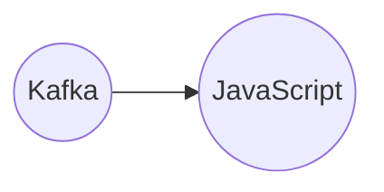

# Connect Kafka to JavaScript

Quix helps you integrate Kafka to JavaScript using pure Python.

## JavaScript

JavaScript is a versatile programming language that is primarily used for creating interactive elements on websites. It allows developers to manipulate website content, respond to user actions, and dynamically update page elements without needing to reload the entire page. JavaScript is a client-side language, meaning it is executed on the user's browser rather than the server. This makes it a powerful tool for creating engaging user experiences, such as animations, form validations, and interactive maps. JavaScript is also commonly used in conjunction with HTML and CSS to create dynamic and visually appealing web applications. Its widespread adoption and flexibility make it a crucial technology for front-end web development.

## Integrations

JavaScript is a widely used and versatile programming language that is commonly used for web development, including frontend and backend applications. Integrating Quix with JavaScript can benefit developers in several ways:

1. Flexibility: JavaScript is a versatile language that can be used on both the frontend and backend, making it a flexible choice for integrating with a platform like Quix. Developers can leverage JavaScript to build data pipelines, interact with real-time data, and visualize data in web applications.

2. Collaboration: JavaScript is a popular language with a large community of developers, making it easier to collaborate and share knowledge when integrating with Quix. With JavaScript, developers can easily find resources, libraries, and support for building and managing data pipelines.

3. Real-time Data Processing: JavaScript is well-suited for handling real-time data processing and interactions, making it a good fit for integrating with a platform like Quix Streams. Developers can use JavaScript to process and analyze real-time data streams, making it easier to build and deploy efficient data pipelines.

4. Scalability: JavaScript frameworks and tools, such as Node.js, provide scalability options for handling large volumes of data. By integrating with Quix, developers can leverage JavaScript's scalability features to manage and process data at scale.

5. Monitoring and Visualization: JavaScript offers a wide range of libraries and tools for data visualization and monitoring. By integrating with Quix, developers can use JavaScript to create interactive visualizations, dashboards, and monitoring tools for tracking pipeline performance and data metrics.

Overall, integrating Quix with JavaScript can enhance development, collaboration, and real-time data processing capabilities for developers working with data pipelines and real-time data streams.

