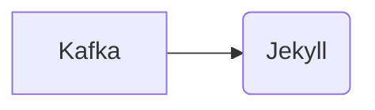

# Connect Kafka to Jekyll

Quix helps you integrate Kafka to Jekyll using pure Python.

## Jekyll

Jekyll is a popular static site generator technology that allows users to easily create and manage websites without the need for a backend database or server. With Jekyll, content is written in plain text files using Markdown or HTML, and the site is built and deployed using templates and layouts. This technology is known for its simplicity and speed, as well as its ability to integrate with version control tools like Git. Jekyll is often used by developers and bloggers looking to create lightweight, fast-loading websites with a clean and customizable design.

## Integrations

Jekyll is a popular static site generator that allows developers to create websites with static HTML files instead of server-side rendering. When integrating Jekyll with Quix, there are several advantages:

1. Scalability: Quix Streams offers resilient scaling capabilities through container orchestration, such as Kubernetes. This complements Jekyll's static site generation approach by allowing the seamless scaling of data processing tasks in real-time.

2. Efficient data processing: Quix Streams' Python interface integrates well with the Python ecosystem, enabling easy data processing with libraries like Pandas, scikit-learn, TensorFlow, and PyTorch. This allows for efficient data manipulation and analysis in conjunction with Jekyll's static site generation.

3. Real-time monitoring: Quix Cloud provides tools for real-time logs, metrics, and data exploration, which can be beneficial for monitoring pipeline performance when integrating Jekyll with data processing tasks using Quix Streams.

4. Enhanced collaboration: Quix Cloud supports efficient collaboration with organization and permission management, increasing project visibility and control. This can enhance the collaboration between developers working on Jekyll websites and data processing tasks using Quix Streams.

5. Security and compliance: Quix Cloud ensures secure management of secrets and compliance with dedicated infrastructure options and SLAs, which is crucial when integrating sensitive data processing tasks with a Jekyll website.

