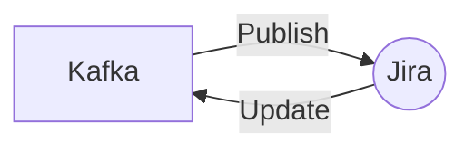

# Connect Kafka to Jira

Quix helps you integrate Kafka to Jira using pure Python.

<a class="md-button md-button--primary" href="https://share.hsforms.com/1iW0TmZzKQMChk0lxd_tGiw4yjw2?__hstc=175542013.2303933fbd746c0ac86d9ccbe9bc9100.1728383268831.1729603416735.1729620918855.31&__hssc=175542013.1.1729620918855&__hsfp=2132701734" target="_blank" style="margin-right:.5rem;">Book a demo</a>
 

## Jira

Jira is a widely used project management and issue tracking tool developed by Atlassian. It allows teams to plan, track, and manage their work efficiently, making it an essential tool for agile software development teams. Jira provides a flexible platform for creating custom workflows, tracking bugs, and organizing tasks in a kanban or scrum board format. It also offers advanced reporting features, real-time collaboration, and integrations with popular development tools like Bitbucket and Confluence. Overall, Jira streamlines project management processes and improves team communication, making it a valuable tool for any organization.

## Integrations

Quix is a good fit for integrating with Jira because of its streamlined development and deployment capabilities, enhanced collaboration features, and real-time monitoring and scaling capabilities. 

- Streamlined Development and Deployment: Quix's integrated online code editors and CI/CD tools make it easy to create and deploy data pipelines, which can streamline development workflows and make it easier to track project progress within Jira.

- Enhanced Collaboration: The collaboration features in Quix, such as organization and permission management, increase project visibility and control, allowing teams to work more efficiently together. This enhanced collaboration can be seamlessly integrated with Jira's project management capabilities.

- Real-Time Monitoring: Quix's real-time monitoring tools for logs, metrics, and data exploration allow users to monitor pipeline performance and critical metrics, providing valuable insights that can be shared and tracked within Jira.

- Flexible Scaling and Management: Quix's ability to easily scale resources, manage CPU and memory, and handle multiple environments tied to Git branches can help teams stay organized and easily manage their projects within Jira.

Overall, integrating Quix with Jira can help enhance project management, collaboration, and monitoring capabilities, making it a strong fit for organizations looking to streamline their development workflows and improve their data pipeline management.

