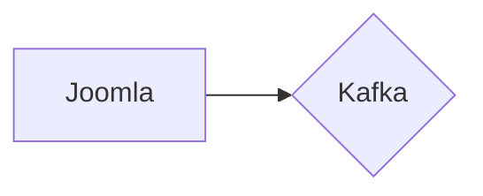

# Connect Kafka to Joomla

Quix helps you integrate Kafka to Joomla using pure Python.

## Joomla

Joomla is a free and open-source content management system (CMS) that is used to build websites and online applications. It is built on the PHP programming language and is supported by a MySQL database. Joomla is known for its user-friendly interface, ease of use, and extensibility. It provides a wide range of features and functionalities, including the ability to create and manage content, customize website layouts, and integrate with third-party applications. Joomla also offers a large library of templates and extensions that help users customize their websites and add new functionality. Overall, Joomla is a powerful and versatile technology that is used by individuals, businesses, and organizations to create a wide variety of websites and online applications.

## Integrations

Quix would be a good fit for integrating with Joomla for a few reasons. 

1. Streamlined Development and Deployment: The integrated online code editors and CI/CD tools in Quix Cloud make it easy to develop and deploy data pipelines, which can be helpful for integrating with Joomla and managing real-time data.

2. Enhanced Collaboration: Quix Cloud's organization and permission management tools can improve collaboration among team members working on Joomla projects, enhancing project visibility and control.

3. Real-Time Monitoring: The real-time monitoring tools in Quix Cloud would allow Joomla developers to monitor pipeline performance and critical metrics in real-time, helping them identify and address any issues quickly.

4. Flexible Scaling and Management: Quix Cloud makes it easy to scale resources and manage CPU and memory, which can be useful for handling large amounts of data in Joomla websites.

5. Security and Compliance: Quix Cloud ensures secure management of secrets and compliance with dedicated infrastructure options, providing a secure environment for integrating with Joomla.

6. Development Tools: The development tools in Quix Cloud, such as online code editors and connectors for data sources, can streamline the integration process with Joomla and enhance development workflows.

Overall, the features and capabilities of Quix make it a suitable choice for integrating with Joomla, providing a comprehensive platform for developing, deploying, and managing real-time data pipelines efficiently.

