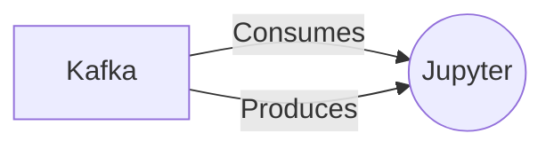

# Connect Kafka to Jupyter

Quix helps you integrate Kafka to Jupyter using pure Python.

## Jupyter

Jupyter is an open-source web application that allows users to create and share documents containing live code, equations, visualizations, and narrative text. Originally developed for the Python programming language, Jupyter supports over 40 programming languages and is widely used by data scientists, researchers, and educators for data analysis, machine learning, and interactive computing. The key feature of Jupyter is its ability to run code in a flexible environment, known as a Jupyter notebook, which enables users to experiment with code, visualize data, and document their workflows in a single interface. Additionally, Jupyter notebooks can be easily shared and collaborated on through platforms like GitHub or JupyterHub, making it a powerful tool for reproducible research and interactive teaching.

## Integrations

Quix Streams and Quix Cloud are both great options for integrating with Jupyter due to their compatibility with Python and their support for real-time data processing. Jupyter is a popular platform for interactive data analysis and visualization, and being able to use Quix Streams and Quix Cloud with Jupyter notebooks allows for seamless integration of data pipelines and analysis workflows.

The Python ecosystem integration of Quix Streams allows users to work with popular Python libraries like Pandas, scikit-learn, TensorFlow, and PyTorch within Jupyter notebooks. This makes it easy to perform advanced data analysis and machine learning tasks while leveraging the scalability and real-time capabilities of Quix Streams.

Additionally, the local and Jupyter notebook support of Quix Streams enables developers to conveniently develop, debug, and collaborate on data pipelines within the Jupyter environment. This enhances productivity and streamlines the workflow for building and deploying real-time data pipelines.

Overall, the comprehensive features and flexibility of Quix Streams and Quix Cloud make them a good fit for integrating with Jupyter, providing users with a powerful and efficient platform for developing, deploying, and managing real-time data pipelines with Python.

