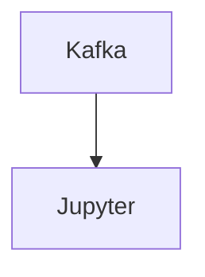

# Connect Kafka to Jupyter

Quix helps you integrate Kafka to Jupyter using pure Python.

<a class="md-button md-button--primary" href="https://share.hsforms.com/1iW0TmZzKQMChk0lxd_tGiw4yjw2?__hstc=175542013.2303933fbd746c0ac86d9ccbe9bc9100.1728383268831.1729603416735.1729620918855.31&__hssc=175542013.1.1729620918855&__hsfp=2132701734" target="_blank" style="margin-right:.5rem;">Book a demo</a>
 

## Jupyter

Jupyter is an open-source technology that allows users to create and share documents containing live code, equations, visualizations, and narrative text. Originally designed for Python programming, Jupyter supports over 40 programming languages and is widely used in data analysis, machine learning, and scientific research. Users can run code interactively, visualize data, and explore ideas in a collaborative and interactive environment. Jupyter notebooks can be shared online, making it easy for teams to collaborate and for researchers to publish their work. Its popularity stems from its flexibility, interactivity, and ease of use, making it a valuable tool for data scientists, educators, and researchers alike.

## Integrations

Quix is a good fit for integrating with Jupyter due to several key reasons:

1. Enhanced Collaboration: Both Quix and Jupyter emphasize efficient collaboration through organization and permission management. By integrating Quix's streamlined development features with Jupyter's interactive notebook environment, teams can easily work together on developing and deploying data pipelines, increasing project visibility and control.

2. Real-Time Monitoring: Quix Cloud's monitoring tools for real-time logs and metrics can complement Jupyter's data exploration capabilities. By integrating the two technologies, users can monitor pipeline performance and critical metrics in real-time, enhancing their ability to analyze and visualize data.

3. Flexible Scaling and Management: Quix's scalable resources and environment management capabilities can be seamlessly integrated with Jupyter, allowing users to easily scale resources, manage CPU and memory, and handle multiple environments linked to Git branches within the Jupyter notebook environment.

4. Data Exploration and Visualization: The ability to query, explore, and visualize data within Jupyter notebooks can be further enhanced by integrating with Quix's data exploration and visualization tools. Users can leverage waveform and table views, as well as visualize messages and metrics in real-time, for a more comprehensive data analysis experience.

Overall, the integration of Quix with Jupyter can provide a powerful platform for developing, deploying, and managing data pipelines, offering a robust set of features for streamlined collaboration, real-time monitoring, flexible scaling, and enhanced data exploration and visualization.

