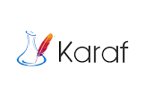

# Connect Kafka to Apache Karaf

Quix helps you integrate Apache Kafka with Apache Karaf using pure Python.

Transform and pre-process data, with the new alternative to Confluent Kafka Connect, before loading it into a specific format, simplifying data lake house arthitecture, reducing storage and ownership costs and enabling data teams to achieve success for your business.

## Apache Karaf

Apache Karaf is an open-source OSGi runtime that provides a lightweight container for running OSGi-based applications. It offers a flexible and extensible platform for deploying, managing, and monitoring applications in a dynamic and modular way. With features such as hot deployment, centralized configuration management, and dependency injection, Apache Karaf simplifies the development and deployment of complex, enterprise-level applications. It also supports a wide range of plugins and extensions, making it easy to integrate with other technologies and frameworks. Apache Karaf is a powerful tool for building scalable and reliable applications in a modular and efficient manner.

## Integrations

- __Find out how we can help you integrate!__

    <a class="md-button md-button--primary" href="https://share.hsforms.com/1iW0TmZzKQMChk0lxd_tGiw4yjw2?__hstc=175542013.2303933fbd746c0ac86d9ccbe9bc9100.1728383268831.1729603416735.1729620918855.31&__hssc=175542013.1.1729620918855&__hsfp=2132701734" target="_blank" style="margin:.5rem;">Book a demo</a>

UNRECOGNIZED TECH ALERT. 

Quix is a suitable choice for integrating with Apache Karaf due to its ability to allow data engineers to pre-process and transform data from multiple sources before loading it into a specific format. This capability simplifies the lakehouse architecture by providing customizable connectors for different destinations. Additionally, Quix Streams, an open-source Python library, enables the transformation of data using streaming DataFrames, which supports operations such as aggregation, filtering, and merging during the transformation process. 

Furthermore, the platform ensures efficient data handling from source to destination with features like no throughput limits, automatic backpressure management, and checkpointing. Quix also supports sinking transformed data to cloud storage in a particular format, ensuring seamless integration and storage efficiency at the destination. In terms of cost, Quix offers a cost-effective solution for managing data throughout the integration process, making it a more economical choice compared to other alternatives.

