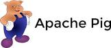

# Connect Kafka to Apache Pig

Quix helps you integrate Apache Kafka with Apache Pig using pure Python.

Transform and pre-process data, with the new alternative to Confluent Kafka Connect, before loading it into a specific format, simplifying data lake house architecture, reducing storage and ownership costs and enabling data teams to achieve success for your business.

## Apache Pig

Apache Pig is an open-source technology developed by the Apache Software Foundation that simplifies the programming of large-scale data processing tasks on Hadoop clusters. It provides a high-level language called Pig Latin, which allows users to write complex MapReduce tasks without having to write lengthy Java code. With Apache Pig, users can easily transform and analyze large datasets in a distributed environment, making it a valuable tool for data engineers and analysts working with Big Data.

## Integrations

- __Find out how we can help you integrate!__

    <a class="md-button md-button--primary" href="https://share.hsforms.com/1iW0TmZzKQMChk0lxd_tGiw4yjw2?__hstc=175542013.2303933fbd746c0ac86d9ccbe9bc9100.1728383268831.1729603416735.1729620918855.31&__hssc=175542013.1.1729620918855&__hsfp=2132701734" target="_blank" style="margin:.5rem;">Book a demo</a>

UNRECOGNIZED TECH ALERT

