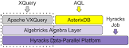

# Connect Kafka to Apache VXQuery

Quix helps you integrate Apache Kafka with Apache VXQuery using pure Python.

Transform and pre-process data, with the new alternative to Confluent Kafka Connect, before loading it into a specific format, simplifying data lake house architecture, reducing storage and ownership costs and enabling data teams to achieve success for your business.

## Apache VXQuery

Apache VXQuery is an open-source, high-performance query processing engine built on top of the Apache AsterixDB platform. It provides users with a powerful tool for executing complex queries on large datasets with efficiency and speed. With its support for XQuery, a flexible and expressive query language for XML and JSON documents, Apache VXQuery enables developers to extract valuable insights from their data quickly and easily. This technology is a game-changer for organizations looking to harness the full potential of their data assets and make informed decisions based on real-time analysis.

## Integrations

- __Find out how we can help you integrate!__

    <a class="md-button md-button--primary" href="https://quix.io/book-a-demo" target="_blank" style="margin:.5rem;">Book a demo</a>

Quix is an ideal solution for integrating with Apache VXQuery due to its versatile data processing capabilities. With Quix, data engineers can efficiently pre-process and transform data from various sources before loading it into a specific data format, simplifying the lakehouse architecture with customizable connectors for different destinations. 

Furthermore, Quix Streams, an open-source Python library, enables the seamless transformation of data using streaming DataFrames, supporting essential operations like aggregation, filtering, and merging during the transformation process. This streamlined approach ensures efficient handling of data from source to destination with no throughput limits, automatic backpressure management, and checkpointing, guaranteeing a smooth data integration process.

In addition, Quix supports sinking transformed data to cloud storage in a specific format, ensuring seamless integration and storage efficiency at the destination. This capability not only enhances the overall data management process but also contributes to lowering the total cost of ownership compared to other alternatives.

Overall, Quix provides a cost-effective and comprehensive solution for managing data integration from source to destination, making it an excellent fit for integrating with Apache VXQuery.

