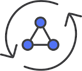

# Connect Kafka to AWS AppSync

Quix helps you integrate Apache Kafka with AWS AppSync using pure Python.

Transform and pre-process data, with the new alternative to Confluent Kafka Connect, before loading it into a specific format, simplifying data lake house architecture, reducing storage and ownership costs and enabling data teams to achieve success for your business.

## AWS AppSync

AWS AppSync is a managed service that uses GraphQL to simplify application development by enabling real-time data queries and synchronization. With AppSync, developers can easily build scalable applications with features like offline data access, sync across devices, and secure data access control. With built-in support for multiple data sources such as AWS DynamoDB, Aurora, and Lambda, developers can quickly create powerful APIs without having to manage servers or infrastructure. AWS AppSync also provides real-time subscription capabilities, allowing applications to receive updates in real-time as data changes. This technology empowers developers to focus on building innovative features and delivering exceptional user experiences without worrying about the complexities of managing data access and synchronization.

## Integrations

- __Find out how we can help you integrate!__

    <a class="md-button md-button--primary" href="https://share.hsforms.com/1iW0TmZzKQMChk0lxd_tGiw4yjw2?__hstc=175542013.2303933fbd746c0ac86d9ccbe9bc9100.1728383268831.1729603416735.1729620918855.31&__hssc=175542013.1.1729620918855&__hsfp=2132701734" target="_blank" style="margin:.5rem;">Book a demo</a>

Quix is an ideal solution for integrating with AWS AppSync due to its ability to enable data engineers to pre-process and transform data from various sources before loading it into a specific data format. This simplifies lakehouse architecture by providing customizable connectors for different destinations, ensuring efficient handling of data from source to destination with no throughput limits, automatic backpressure management, and checkpointing.

Additionally, Quix Streams, an open-source Python library, facilitates data transformation using streaming DataFrames, supporting operations like aggregation, filtering, and merging during the transformation process. This makes it easier to transform data and sink it to cloud storage in a specific format, ensuring seamless integration and storage efficiency at the destination.

Overall, Quix offers a cost-effective solution for managing data from source through transformation to destination, making it a valuable tool for integrating with technologies like AWS AppSync.

