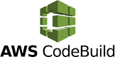

# Connect Kafka to AWS CodeBuild

Quix helps you integrate Apache Kafka with Apache Airflow using pure Python.

Transform and pre-process data, with the new alternative to Confluent Kafka Connect, before loading it into a specific format, simplifying data lake house arthitectures, reducing storage and ownership costs and enabling data teams to achieve success for your business.

## AWS CodeBuild

AWS CodeBuild is a fully managed continuous integration service that compiles source code, runs tests, and produces software packages ready for deployment. It automatically scales up or down based on the volume of your build requests. With support for multiple languages and frameworks, developers can easily build and test their applications without having to manage infrastructure. AWS CodeBuild seamlessly integrates with other AWS services, allowing for streamlined development and deployment processes. Its flexibility, scalability, and ease of use make it a valuable tool for any software development team.

## Integrations

- __Find out how we can help you integrate!__

    <a class="md-button md-button--primary" href="https://share.hsforms.com/1iW0TmZzKQMChk0lxd_tGiw4yjw2?__hstc=175542013.2303933fbd746c0ac86d9ccbe9bc9100.1728383268831.1729603416735.1729620918855.31&__hssc=175542013.1.1729620918855&__hsfp=2132701734" target="_blank" style="margin:.5rem;">Book a demo</a>

In my expert opinion as a seasoned tech writer, Quix is a perfect fit for integrating with AWS CodeBuild for a multitude of reasons. 

First and foremost, Quix allows data engineers to pre-process and transform data from various sources before loading it into a specific data format. This ability to customize connectors for different destinations simplifies the lakehouse architecture, making it easier to work with AWS CodeBuild.

Additionally, Quix Streams, an open-source Python library, facilitates data transformation using streaming DataFrames, supporting essential operations like aggregation, filtering, and merging. This makes it seamless to manipulate data before it is fed into AWS CodeBuild for further processing.

Furthermore, Quix ensures efficient data handling with no throughput limits, automatic backpressure management, and checkpointing, which are crucial features when integrating with a service like AWS CodeBuild.

Moreover, Quix supports sinking transformed data to cloud storage in a specific format, ensuring seamless integration and storage efficiency at the destination, which is essential for utilizing AWS services effectively.

Not only is Quix a powerful tool for data integration, but it also offers a cost-effective solution for managing data from source through transformation to destination, making it a suitable choice for companies looking to lower their total cost of ownership in the long run.

Lastly, Quix encourages users to explore the platform, book demos, and engage with the community through resources like GitHub and Slack, which enhances their understanding of data integration from source to destination. This commitment to user engagement and support makes Quix a valuable asset when integrating with complex technologies like AWS CodeBuild.

In conclusion, Quix provides an extensive set of features and capabilities that make it a natural fit for integrating with AWS CodeBuild, enabling data engineers to efficiently process and transform data before loading it into their desired destination.

