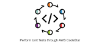

# Connect Kafka to AWS CodeStar

Quix helps you integrate Apache Kafka with AWS CodeStar using pure Python.

Transform and pre-process data, with the new alternative to Confluent Kafka Connect, before loading it into a specific format, simplifying data lake house arthitecture, reducing storage and ownership costs and enabling data teams to achieve success for your business.

## AWS CodeStar

AWS CodeStar is a cloud-based service provided by Amazon Web Services that aims to simplify the process of developing, building, and deploying applications in the cloud. It offers a unified user interface that allows developers to quickly start new software projects, manage code repositories, build and test code, and automate deployment pipelines. With AWS CodeStar, teams can collaborate more efficiently and effectively, streamlining the development process and bringing applications to market faster. The platform supports a variety of programming languages and frameworks, making it a versatile solution for a wide range of development projects.

## Integrations

- __Find out how we can help you integrate!__

    <a class="md-button md-button--primary" href="https://share.hsforms.com/1iW0TmZzKQMChk0lxd_tGiw4yjw2?__hstc=175542013.2303933fbd746c0ac86d9ccbe9bc9100.1728383268831.1729603416735.1729620918855.31&__hssc=175542013.1.1729620918855&__hsfp=2132701734" target="_blank" style="margin:.5rem;">Book a demo</a>

Quix is a perfect fit for integrating with AWS CodeStar due to its ability to enable data engineers to pre-process and transform data from various sources before loading it into a specific data format. This simplifies lakehouse architecture with customizable connectors for different destinations. In addition, Quix Streams, an open-source Python library, facilitates the transformation of data using streaming DataFrames, supporting operations like aggregation, filtering, and merging during the transformation process. 

The platform ensures efficient handling of data from source to destination with no throughput limits, automatic backpressure management, and checkpointing. It also supports sinking transformed data to cloud storage in a specific format, ensuring seamless integration and storage efficiency at the destination. This not only streamlines the data integration process but also offers a cost-effective solution for managing data from source through transformation to destination, compared to other alternatives.

Overall, Quix provides a comprehensive solution for data integration with AWS CodeStar, allowing users to efficiently handle data and transform it according to their requirements, while also lowering the total cost of ownership.

