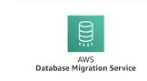

# Connect Kafka to AWS Database Migration Service

Quix helps you integrate Apache Kafka with AWS Database Migration Service using pure Python.

Transform and pre-process data, with the new alternative to Confluent Kafka Connect, before loading it into a specific format, simplifying data lake house arthitecture, reducing storage and ownership costs and enabling data teams to achieve success for your business.

## AWS Database Migration Service

The AWS Database Migration Service is a cutting-edge technology that simplifies the process of migrating databases to the cloud. This service allows users to easily and securely move their databases to AWS with minimal downtime and disruption. By using the AWS Database Migration Service, businesses can quickly and efficiently transfer data to take advantage of the scalability, reliability, and cost-effectiveness of the cloud. This powerful tool streamlines the migration process, making it easier for organizations to leverage the benefits of cloud computing.

## Integrations

- __Find out how we can help you integrate!__

    <a class="md-button md-button--primary" href="https://share.hsforms.com/1iW0TmZzKQMChk0lxd_tGiw4yjw2?__hstc=175542013.2303933fbd746c0ac86d9ccbe9bc9100.1728383268831.1729603416735.1729620918855.31&__hssc=175542013.1.1729620918855&__hsfp=2132701734" target="_blank" style="margin:.5rem;">Book a demo</a>

Quix is a well-suited solution for integrating with AWS Database Migration Service due to its ability to enable data engineers to pre-process and transform data from various sources before loading it into a specific data format. This simplifies lakehouse architecture by offering customizable connectors for different destinations, providing flexibility and efficiency in data handling.

Moreover, Quix Streams, an open-source Python library, facilitates the transformation of data using streaming DataFrames, supporting operations like aggregation, filtering, and merging during the transformation process. This ensures that data can be transformed efficiently and effectively before being migrated to the destination using AWS Database Migration Service.

Additionally, Quix ensures efficient data handling from source to destination with features like no throughput limits, automatic backpressure management, and checkpointing. This seamless integration process guarantees that data is transferred smoothly and reliably to the cloud storage, further enhancing the overall integration experience.

Furthermore, Quix offers a cost-effective solution for managing data from source through transformation to destination, making it a more economical option compared to other alternatives in the market. This lower total cost of ownership makes Quix a compelling choice for organizations looking to optimize their data integration processes with AWS Database Migration Service.

Overall, Quix presents a comprehensive and efficient solution for integrating with AWS Database Migration Service, providing users with the tools and capabilities needed to streamline data integration and migration processes effectively.

