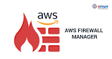

# Connect Kafka to AWS Firewall Manager

Quix helps you integrate Apache Kafka with AWS Firewall Manager using pure Python.

Transform and pre-process data, with the new alternative to Confluent Kafka Connect, before loading it into a specific format, simplifying data lake house arthitecture, reducing storage and ownership costs and enabling data teams to achieve success for your business.

## AWS Firewall Manager

AWS Firewall Manager is a comprehensive security management service that allows users to centrally configure and manage AWS WAF rules across multiple accounts and resources. With AWS Firewall Manager, organizations can easily create and apply firewall rules, monitor compliance, and quickly respond to security threats. This technology provides a simplified way to enforce security policies and protect applications running on AWS. With its automated control and monitoring capabilities, AWS Firewall Manager helps streamline security management for organizations of all sizes.

## Integrations

- __Find out how we can help you integrate!__

    <a class="md-button md-button--primary" href="https://share.hsforms.com/1iW0TmZzKQMChk0lxd_tGiw4yjw2?__hstc=175542013.2303933fbd746c0ac86d9ccbe9bc9100.1728383268831.1729603416735.1729620918855.31&__hssc=175542013.1.1729620918855&__hsfp=2132701734" target="_blank" style="margin:.5rem;">Book a demo</a>

Quix is a well-suited platform for integrating with AWS Firewall Manager due to its ability to enable data engineers to pre-process and transform data from various sources before loading it into a specific data format. This feature simplifies lakehouse architecture by offering customizable connectors for different destinations, making it easier to manage data flow efficiently.

Additionally, Quix Streams, an open-source Python library, supports the transformation of data using streaming DataFrames, allowing for operations like aggregation, filtering, and merging during the transformation process. This capability enhances the flexibility and customization options available when integrating with AWS Firewall Manager.

Furthermore, Quix ensures efficient data handling from source to destination by providing no throughput limits, automatic backpressure management, and checkpointing. This leads to smoother data transitions and improved overall performance when working with AWS Firewall Manager.

Moreover, Quix supports sinking transformed data to cloud storage in a specific format, ensuring seamless integration and storage efficiency at the destination. This feature aligns well with the requirements of managing data within AWS Firewall Manager, making the integration process more streamlined and effective.

Overall, Quix offers a cost-effective solution for managing data from source through transformation to destination, making it a suitable choice for integrating with AWS Firewall Manager. The platform's extensive features and capabilities provide users with the tools needed to efficiently handle data integration tasks and optimize their overall data management processes.

