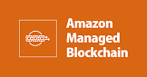

# Connect Kafka to AWS Managed Blockchain

Quix helps you integrate Apache Kafka with AWS Managed Blockchain using pure Python.

Transform and pre-process data, with the new alternative to Confluent Kafka Connect, before loading it into a specific format, simplifying data lake house arthitectures, reducing storage and ownership costs and enabling data teams to achieve success for your business.

## AWS Managed Blockchain

AWS Managed Blockchain is a powerful technology that enables users to create and manage scalable blockchain networks with just a few clicks. By leveraging the secure and reliable infrastructure of AWS, businesses can easily deploy blockchain networks without the need for managing the underlying infrastructure. This technology streamlines the process of setting up a blockchain network, allowing organizations to focus on developing innovative blockchain applications and solutions. With AWS Managed Blockchain, users can benefit from features such as automatic scaling, built-in monitoring, and seamless integration with other AWS services, making it a valuable tool for harnessing the potential of blockchain technology.

## Integrations

- __Find out how we can help you integrate!__

    <a class="md-button md-button--primary" href="https://share.hsforms.com/1iW0TmZzKQMChk0lxd_tGiw4yjw2?__hstc=175542013.2303933fbd746c0ac86d9ccbe9bc9100.1728383268831.1729603416735.1729620918855.31&__hssc=175542013.1.1729620918855&__hsfp=2132701734" target="_blank" style="margin:.5rem;">Book a demo</a>

Quix is a well-suited choice for integrating with AWS Managed Blockchain due to its comprehensive data processing capabilities. The platform allows data engineers to pre-process and transform data from various sources before loading it into a specific format, simplifying the lakehouse architecture. Quix also offers customizable connectors for different destinations, making it easier to handle data seamlessly.

Additionally, Quix Streams, an open-source Python library, enables the transformation of data using streaming DataFrames, supporting operations such as aggregation, filtering, and merging during the process. This feature enhances data processing efficiency and flexibility, making it a valuable tool for integration with AWS Managed Blockchain.

Moreover, Quix ensures efficient data handling from source to destination with features like no throughput limits, automatic backpressure management, and checkpointing. The platform also supports sinking transformed data to cloud storage in a specific format, ensuring seamless integration and storage efficiency at the destination.

Overall, Quix provides a cost-effective solution for managing data from source through transformation to destination, making it a practical choice for integrating with AWS Managed Blockchain. Its robust features and capabilities help streamline the integration process and enhance data processing efficiency.

