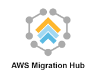

# Connect Kafka to AWS Migration Hub

Quix helps you integrate Apache Kafka with AWS Migration Hub using pure Python.

Transform and pre-process data, with the new alternative to Confluent Kafka Connect, before loading it into a specific format, simplifying data lake house arthitectures, reducing storage and ownership costs and enabling data teams to achieve success for your business.

## AWS Migration Hub

AWS Migration Hub is a comprehensive solution that simplifies and accelerates the process of migrating applications and data to the Amazon Web Services (AWS) cloud. By providing a centralized hub for tracking the progress of multiple migration projects, users gain visibility into their migration readiness, status, and resource utilization. This tool streamlines the migration process by enabling users to assess their application portfolios, discover dependencies, and monitor the overall migration status in real-time. With AWS Migration Hub, organizations can effectively plan, execute, and optimize their migration to the AWS cloud with ease and efficiency.

## Integrations

- __Find out how we can help you integrate!__

    <a class="md-button md-button--primary" href="https://share.hsforms.com/1iW0TmZzKQMChk0lxd_tGiw4yjw2?__hstc=175542013.2303933fbd746c0ac86d9ccbe9bc9100.1728383268831.1729603416735.1729620918855.31&__hssc=175542013.1.1729620918855&__hsfp=2132701734" target="_blank" style="margin:.5rem;">Book a demo</a>

Quix is a well-suited solution for integrating with AWS Migration Hub due to its ability to facilitate efficient data handling from source to destination. The platform enables data engineers to pre-process and transform data from various sources before loading it into a specific format, simplifying the architecture of a lakehouse. Additionally, Quix Streams, an open-source Python library, supports the transformation of data using streaming DataFrames, allowing for operations like aggregation, filtering, and merging during the transformation process. This capability ensures that data can be transformed effectively and efficiently before being integrated with AWS Migration Hub.

Moreover, Quix offers seamless integration with cloud storage, allowing users to sink transformed data in a specific format, enhancing storage efficiency at the destination. The platform also ensures no throughput limits, automatic backpressure management, and checkpointing, further optimizing the handling of data throughout the integration process.

Overall, Quix provides a cost-effective solution for managing data integration from source to destination, making it a suitable choice for organizations looking to streamline their data handling processes. By leveraging the capabilities of Quix, users can enhance their understanding of data integration and optimize the overall data management process within AWS Migration Hub.

