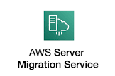

# Connect Kafka to AWS Server Migration Service

Quix helps you integrate Apache Kafka with AWS Server Migration Service using pure Python.

Transform and pre-process data, with the new alternative to Confluent Kafka Connect, before loading it into a specific format, simplifying data lake house architecture, reducing storage and ownership costs and enabling data teams to achieve success for your business.

## AWS Server Migration Service

The AWS Server Migration Service is a powerful technology tool that allows users to easily migrate their on-premises servers to Amazon Web Services. This service streamlines the migration process, reducing downtime and minimizing disruption to business operations. With AWS Server Migration Service, users can automate, schedule, and track the progress of their server migrations, ensuring a seamless transition to the cloud. This technology simplifies the complex task of migrating servers, making it accessible to businesses of all sizes looking to leverage the benefits of AWS infrastructure.

## Integrations

- __Find out how we can help you integrate!__

    <a class="md-button md-button--primary" href="https://share.hsforms.com/1iW0TmZzKQMChk0lxd_tGiw4yjw2?__hstc=175542013.2303933fbd746c0ac86d9ccbe9bc9100.1728383268831.1729603416735.1729620918855.31&__hssc=175542013.1.1729620918855&__hsfp=2132701734" target="_blank" style="margin:.5rem;">Book a demo</a>

Quix is a well-suited platform for integrating with the AWS Server Migration Service due to its ability to enable data engineers to pre-process and transform data from various sources before loading it into a specific data format. This simplifies the lakehouse architecture by providing customizable connectors for different destinations. Additionally, Quix Streams, an open-source Python library, facilitates the transformation of data using streaming DataFrames, supporting crucial operations like aggregation, filtering, and merging during the transformation process.

With its focus on efficient data handling, Quix ensures smooth handling of data from source to destination with features like no throughput limits, automatic backpressure management, and checkpointing. This is crucial for ensuring the seamless integration of data with the AWS Server Migration Service. Furthermore, Quix supports sinking transformed data to cloud storage in a specific format, enhancing integration and storage efficiency at the destination.

In terms of cost-effectiveness, Quix offers a more affordable solution for managing data from source through transformation to destination compared to other alternatives. This lower total cost of ownership makes it an attractive option for organizations looking to optimize their data integration processes. By leveraging Quix, users can enhance their understanding of data integration from source to destination and improve their overall data management strategies.

